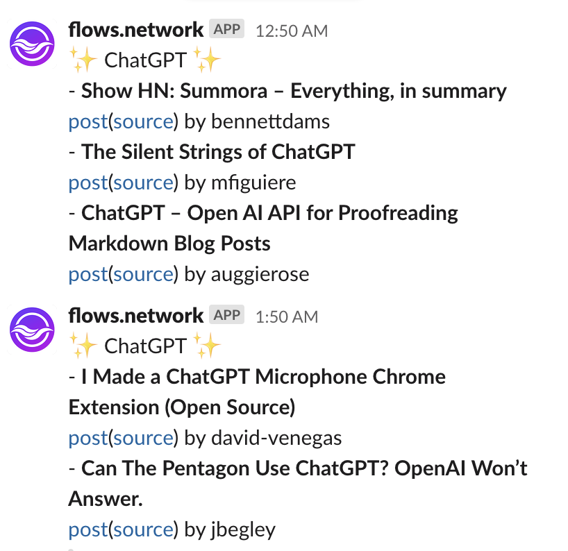
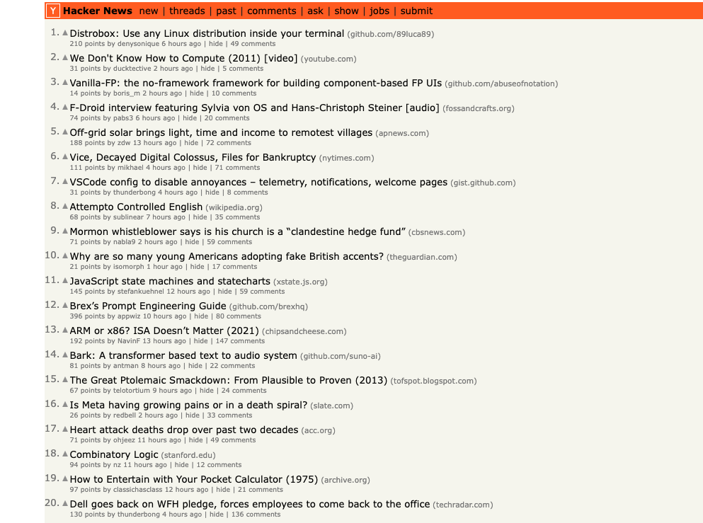

If you're a hacker who frequents the popular news aggregation site Hacker News, you know how quickly posts can get lost in the shuffle. With hundreds of new stories appearing each day, it can be tough to keep up with the topics that matter most to you. But what if there was a way to be notified anytime a post contained a specific keyword? That's where this article comes in. 

I will walk you through how to build a bot to automatically send Slack messages if a Hacker News post contains the keyword you are concerned with on [the flows.network platform](https://flows.network/). You can also extend this Hacker News bot to another SaaS platform that flows.network has integrated, like Notion, Discord, Telegram, Airtable, and so on.

## What is Hacker News

Before we start, let’s learn more about Hacker News. If you’re familiar with Hacker News, you can skip the next two sections. Hacker News is a social news website focused on technology and startups. It was created by Paul Graham's investment fund and startup incubator, Y Combinator, originally as a way for Y Combinator founders to share information and news.

Today, Hacker News has evolved into a popular online community for entrepreneurs, tech enthusiasts, and investors to share and discuss news, articles, and information related to technology, startups, and the wider tech industry. The website features a minimalist design that prioritizes original content and discussions over flashy graphics and ads.

Hacker News can be used as a valuable resource for people interested in keeping up with the latest news and trends in the tech industry. By participating in discussions and sharing content on Hacker News, individuals can gain exposure for their own projects, ideas, and businesses, as well as connect with other like-minded individuals who can offer valuable insights and feedback. 

## Why we need a tool to  search and monitor the posts of Hacker News

As an entrepreneur, tech enthusiast, or investor, staying on top of industry news and trends is crucial. However, manually scanning through every Hacker News post each day is time-consuming and impractical. However, with flows.network, it’s possible to build a Hacker News Slack bot to search and monitor keywords that we value. The benefits of the bot are

* Automatic: It will automatically send you the Hacker News posts via Slack messages at the scheduled time. No need to keep an eye on the Hacker News website.
* Scheduled and recorded: Schedule a time at your convenience to receive the Hacker News alerts. One of the reasons why we choose Slack is that Slack could help us save the past Hacker News posts.
* Flexible: You can customize the time you receive the Hacker News post. You also change another SaaS tool like Airtable as a receiver.

## How to create  a  Hacker News Slack bot, taking ChatGPT as an example

Now that we've established the need and benefits for a Hacker News Slack bot. let's take a closer look at how to build your own on flows.network. It's quite easy.  

For example, if a post on Hacker News contains ChatGPT, you will receive a message on a Slack channel. This message will include the post’s Hacker News link and the source link of the post.

> Make sure you have signed up for an account for [flows.network](https://flows.network/).

1. [**Load the Hacker News alert bot template in flows.network****.**](https://flows.network/flow/createByTemplate/hackernews-alert) The template contains the source code for the bot itself. We will clone the source code to your own GitHub account so that you can modify and customize it later. 
2. Configure the `KEYWORD`. Input the area that matters to you, like ChatGPT. Only support one keyword right now. After that, click on Create and Deploy. 
3. **Authorize bot access to Slack.** The `slack_workspace` and `slack_channel` point to the target Slack channel where the bot will send you the ChatGPT related Hacker News Post. Input your Slack workspace and channel here. Next, click on Connect to give the repo the necessary permissions in Slack.

[Click here to see how to create a Hacker News Alert Slack bot in three steps.](https://github.com/flows-network/hackernews-alert)

That’s it. After that, you will receive a message if the Hacker News Post contains ChatGPT every hour at the 50th minute. Then, you won’t miss any Hacker News Posts related to ChatGPT.

## What is the difference between Hacker News RSS and a Slack bot

Compared with Hacker News RSS, one of the advantages of a Hacker News Slack bot is that the bot can be integrated into the SaaS tools you often use. But with Hacker News RSS, you need to install an extra tool to read the RSS feed.

Furthermore, you can also integrate ChatGPT into this Slack bot and [ask ChatGPT to summarize all the Hacker News Posts](https://github.com/flows-network/hacker-news-alert-chatgpt-slack/tree/main/).

If you own a community on Discord, check out the Discord version to [monitor Hacker News posts containing the keyword you're interested in and ask ChatGPT to give a summary of each post](https://github.com/flows-network/hacker-news-alert-chatgpt-discord/tree/main/).

Give it a try now! Join flows.network [Discord](https://discord.com/invite/TrPfq677au) server to get the latest updates or request some features.
