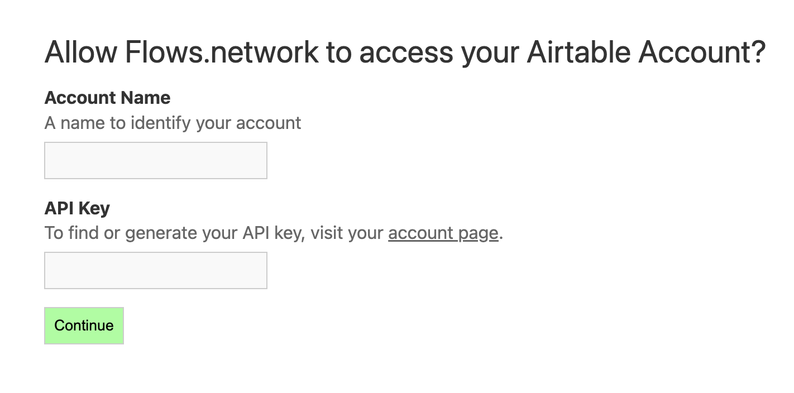
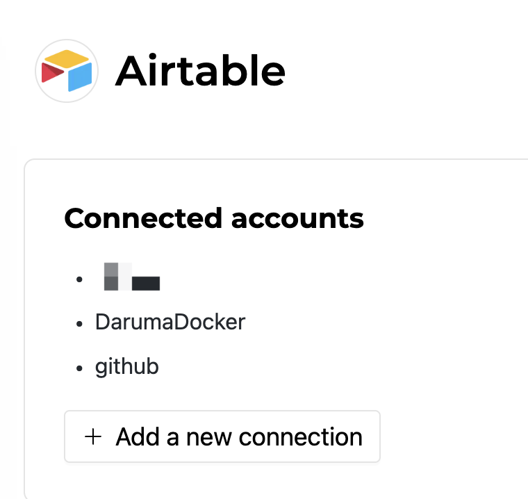

# How to connect Airtable on flows.network

When you using a pre-build template with Airtable, you will need to configure `airtable_table_name`, `airtable_base_id` and `airtable_token_name`. And you also need to grant flows.network to access your Airtable via the API key provided by Airtable.

| Name                  | Value                                  | Remark                                                                                                   |
|-----------------------|----------------------------------------|----------------------------------------------------------------------------------------------------------|
| `airtable_table_name` | A string of alphabets begins with `tb` | the name of the table you want to add data, which you can find on Airtable.                              |
| `airtable_base_id`    | A string of alphabets begins with `app` | the base id to which the table you wish to add or retrieve data belongs, which you can find on Airtable. |
| `airtable_token_name` | A string of word (s)                   | the name of the Airtable API token, which is defined by you.                                             |

In this article, I will show you how to configure these parameters to make your flow work.


## Creating a flow from a template

flows.network will give you the UI instruction when creating a flow **from a template**. 

### Configure `airtable_table_name`, `airtable_base_id` and `airtable_token_name`

Generally, you can see the following image.


On the top of the section, you can see that you need to type `airtable_table_name` and `airtable_token_name`. As I mentioned before, `airtable_table_name` and `airtable_base_id` tell flows.network where to add or read data.

So the first step is to go to your Airtable base and get the current URL.

```
https://airtable.com/appNEswczILgUsxML/tblyMHEVEkFkHM7Z1/viwdHLVHdR603VNlL?blocks=hide

                    |----base_id-----| |----table_name--|
```

The `base_id` is begun with `app` and the `table_name` is begun with `tb`. Copy and paste the two parameters.

The last one is `airtable_token_name`. Here you can just type a name that you want to name your API key.


### Add your Airtable API token

After typing these parameters, click the purple Connect button to add your Airtable API key. Then you will be redirected to a new page.



Give your Airtable key a name, which should be the same as you just typed for the `airtable_token_name`. Then copy and paste your key here. After that, click on the Continue button and you will be redirected to the Airtable integration page, and the key you just added will be popped into this page. Then close this tab and go back to the Creating a Flow page to finish the flow. Once you connect successfully, you won’t do it again when you create another flow.

**Or you can also add your Airtable token before creating a flow**. Once you finish this, you don’t need to connect it again when you're creating a flow.

After you sign in flows.network, go to [the Airtable integration](https://flows.network/integration/Airtable) page and click on Connect button. Then you will be redirected to a new page.


We need to name your Airtable key and copy and paste your key here. After that, click the Continue button, and you will be redirected to the Airtable integration page, and the key you just added will be popped on this page.



That’s it. Remember your Airtable API token name because you will use the name when you create a flow. 


