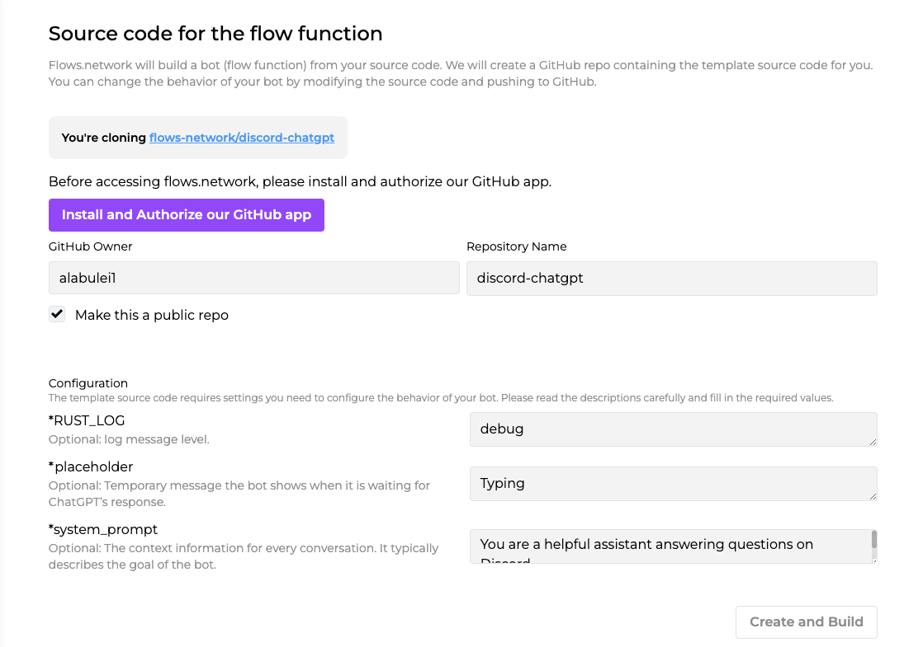
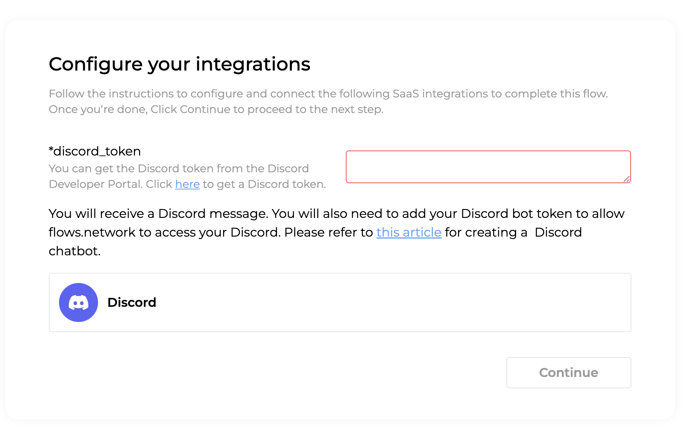
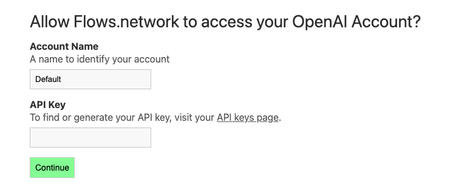

[Flows.network](https://flows.network/) is a serverless platform that allows you to build and deploy LLM applications without worrying about infrastructure management. In this guide, we will walk you through the process of building a ChatGPT Discord bot using flows.network, step-by-step. **More importantly, you don’t need to master any coding skills.**

This bot can
*  Customizable prompts - You can copy and paste any prompt for the bot to respond to. Feel free to get creative!
* Direct message responses - Have a private conversation with the bot by direct messaging it.
* Channel message responses - The bot can respond to messages posted in channels, allowing all channel members to interact with it.
* External service integration - Services like OCR can be integrated to expand the bot's functionality. For example, [the bot can process images with OCR](https://docs.rs/cloud-vision-flows/0.1.1/cloud_vision_flows/).

## 1. Get a Discord Bot Token

To get started, you need to have a Discord account. And then follow these steps:

> You can also refer to [How to create a Discord chat bo](https://flows.network/blog/discord-chat-bot-guide)t for more information.

### 1.1 Create a New Application 

* Visit the Discord Developer Portal and log in with your Discord account.
* Click on "New Application" and provide a name for your bot.
* Navigate to the "Bot" tab and click on "Add Bot."

### 1.2 Obtain Bot Token

* Go back to the "Bot" tab and click on "Copy" under the "TOKEN" section. Keep this token secure as it will be used to authenticate your bot.
* Turn on the "PRESENCE INTENT", "SERVER MEMBERS INTENT", and "MESSAGE CONTENT INTENT" settings.

### 1.3 Add a Bot to Your Application

* Under the "OAuth2" tab, select the "bot" scope.
* Scroll down and select the required bot permissions based on your bot's functionality.
* Copy the generated bot invite URL and invite the bot to your server. You can see your bot is offline.

## 2. Set up a flows.network Account

Now that you have set up your Discord bot account, let's set up a [flows.network](https://flows.network/) account.

* Visit the flows.network website and sign up for a new account with your GitHub account.

## 3. Create the Discord ChatGPT Bot on flows.network

All the preparations are ready. Let’s create a Discord ChatGPT bot from a template.

### 3.1  Load the ChatGPT Discord Bot template

Click [here](https://flows.network/flow/createByTemplate/discord-chatgpt) to load the ChatGPT Discord bot template.

Click the purple Install and Authorize our GitHub app to grant flows.network to access your GitHub repo. After that, review the system_prompt. You can copy and paste prompts from here. The text you input here decides what the role of the chatbot.

Then, Click Create and Build to process.

### 3.2 Configure the Bot

Next, configure the integrations required by this flow template. It’s Discord and ChatGPT API keys.

Copy and paste your Discord token into the red rectangle. Then click the Continue button.

Next, let’s configure the ChatGPT API key. 

Click on Connect, and you will be redirected to a new page where you can copy and paste your OpenAI key here.

Close the tab and go back to the flow.network page once you are done. Click on the Deploy button.

### 4. Test and Interact with the Bot

Once the status of the flow turns ready and running, go back to your Discord server and you can find the bot is online now. DM the bot and the bot will now answer your questions.

## Conclusion

By following this step-by-step guide, you have learned how to build a ChatGPT Discord bot on flows.network, without any coding! flows.network provides a serverless platform to simplify the deployment process and allows you to focus on building engaging chat experiences for your Discord community. Have fun experimenting and building conversational experiences with your new bot!

## Other templates using Discord

* [Send GitHub issues with specific labels to Discord](https://flows.network/flow/createByTemplate/github-issue-notification-tracker)
* [Monitor the Hacker News posts that you're interested in and let ChatGPT give a summary of the Post.](https://flows.network/flow/createByTemplate/hacker-news-alert-chatgpt-discord)

## FAQs

**Is flows.network a free platform?** 

flows.network is currently free to use.

**Can I integrate other APIs with my flows.network bot?**

Yes, flows.network allows you to integrate various SaaS APIs to enhance the functionality of your bot. You can connect to external services, databases, and other APIs as needed. Check out the Hacker-News-ChatGPT-Discord function, which access API for Hacker News.

**What kind of customization options are available for the ChatGPT on flows.network?** 

flows.network provides configuration options: `systerm_prompt` to customize the behavior of the ChatGPT bot. And the bot's source code is available in the GitHub repo you cloned from the template. You can set the response length, retry times to guide the bot's behavior if you can change the source code.

**Can I deploy multiple bots on flows.network?** 

Of course, you can deploy multiple bots on flows.network.

You can [manually create a new flow](https://flows.network/flow/new) and import the source code repo for the bot (i.e., the repo you cloned from the template). Then configure the OPENAI and Discord integrations accordingly. 

>You can have a single flow function repo deployed as the source code for multiple bots. When you update the source code in the repo, and push it to GitHub, it will change the behavior of all the bots.

