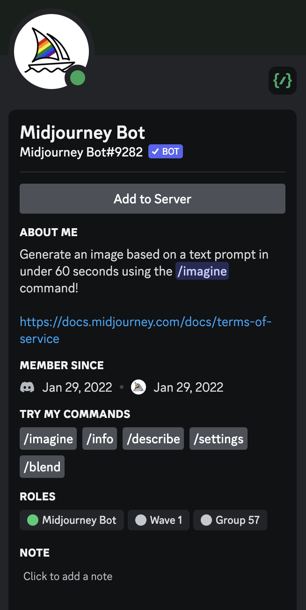
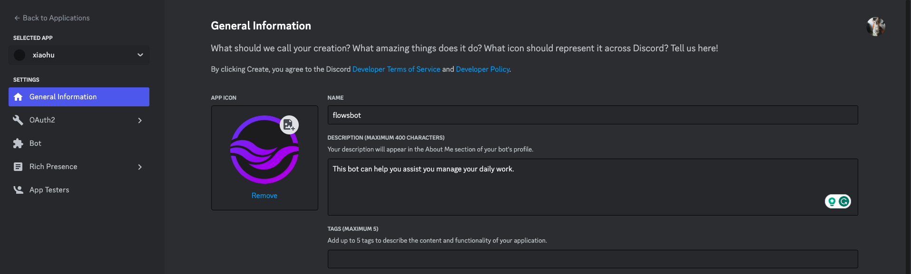
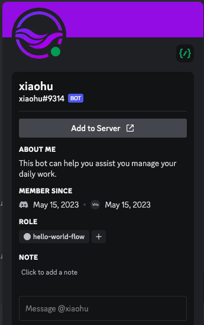
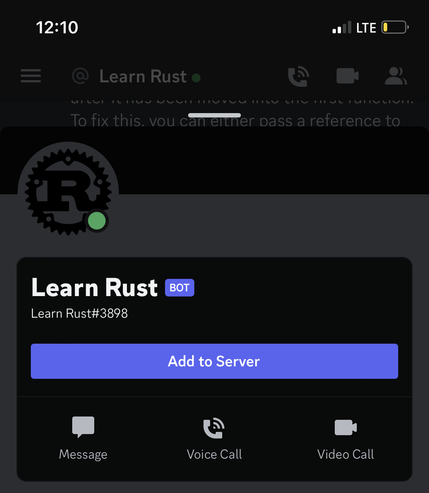
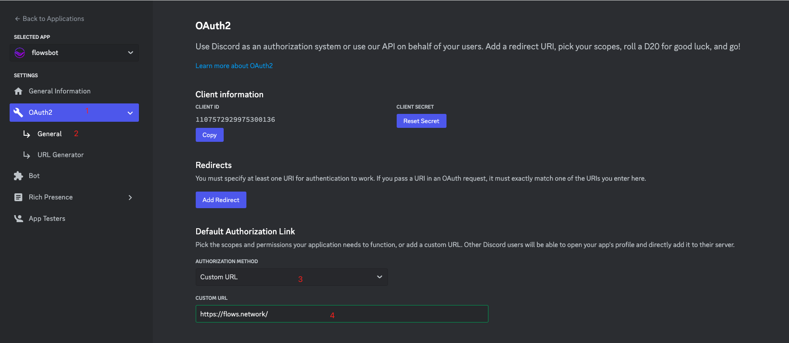
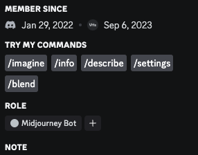

Intended originally for gamers, Discord has evolved into a popular platform for online communities. The versatility of Discord lies in its bots - automated programs that interact with users and add functionality, improving the user experience. From tracking games and assigning roles to playing music and more, Discord bots bring unique utility to the digital world. 

Today, some companies essentially run their entire business on Discord using bots - Midjourney is a prime example. Midjourney's AI art bot handles all of its operations through Discord, allowing users to generate images via text prompts. Having an appealing profile helps your bots stand out and attract more users, just like Midjourney's.

## Why Optimize Your Discord Bot's Profile

Optimizing a Discord bot's profile is like polishing a diamond. As developers, we invest time and effort into designing and programming these bots to perform specific tasks. However, presentation is just as critical as functionality. An optimized profile not only improves the user experience but also enhances the bot's credibility and effectiveness.

With an optimized profile, your bot maintains a consistent identity, becoming easily recognizable to users. It also clearly conveys the bot's purpose and capabilities, reducing confusion. Additionally, an appealing and professional profile can increase server engagement.

Optimizing isn't merely about aesthetics and user engagement, either. From a technical standpoint, optimized bots can use server resources more efficiently, reducing lag and latency. By refining your bot's code and permissions, you ensure that your bot carries out its functions smoothly and without error, contributing positively to the overall health of your server.

In this article, I will show you several ways to make your Discord bot profile attractive.

## Add an Icon, Description, and Tags for your Discord bot

An icon and clear description can help users understand what your Discord bot does.

To add the above information, you can simply go to the [Discord Developer Portal](https://discord.com/developers/applications) and click your bot icon. Then you will be redirected to the bot details pages.

Click the General Information tab on the left, you can upload an icon, edit the description, and write some tags for your Discord bot. Before you leave this page, make sure you have saved the changes.

With a good icon, description, and tags, your bot's purpose will be clear on its profile.

## Get an "Add to Server" Button

If your Discord bot is public, like Midjourney, you may want others to be able to add it to their servers. You can add an "Add to Server" button to your bot's profile. You can customize the link it points to, like your bot's invite link or a landing page.

To add this feature, we still need to go to the [Discord Developer portal](https://discord.com/developers/applications) and enter the bot detail page. 

* Click on the OAuth2 tab on the right
* Click on the General tab on the right
* Go to find the Default Authorization Link and choose Custom URL
* Add your URL in the box
* Save the changes before you leave.

Please note that your bot must be **public** to activate this feature. 

## List the Top 5 Slash Commands on your Discord Profile

Discord recently released a new feature “Try my commands” to list the top 5 used slash commands of your Discord bot, which can help user onboard your bot quickly. 

However [this feature is only open to verified Discord bots](https://stackoverflow.com/a/73761838). To be verified, your bot must be in over 75 servers. Once verified, if your bot has at least one global slash command, its top 5 most used slash commands will automatically appear in the "Try My Commands" section. 

There are many other tips to optimize your Discord bot. We'll continue adding to this article, so stay tuned.

[Flows.network](https://flows.network/) is a serverless platform for developing, building, and hosting Discord bots that connect to external web services and other SaaS tools.

Here are some tutorials for you to get started:

* [Get started with the Discord bot](https://docs.flows.network/docs/getting-started-developer/hello-world-discord)
* [Build a Discord bot with slash commands](https://github.com/flows-network/discord-api-demo)
* [Build a ChatGPT Discord bot](https://docs.flows.network/docs/tutorials/discord-chatgpt)
* [Build a Discord bot that connects GitHub](https://github.com/flows-network/issue-tracker)

