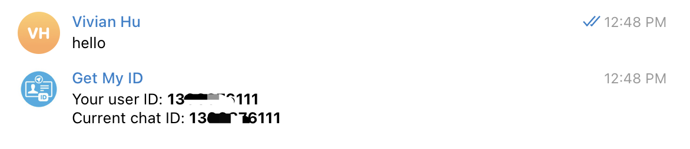
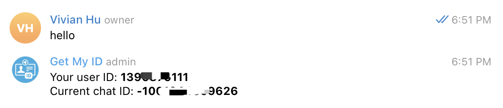

## **Introduction**

Telegram is a popular messaging platform that allows users to communicate with individuals or groups through chats. In some cases, you may need to find the Chat ID or Group Chat ID for your Telegram conversations. In this guide, we will walk you through the process of finding the Telegram Chat ID and Group Chat ID.

>For a Telegram bot token, please check out [How to get a Telegram bot token](https://flows.network/blog/how-to-get-a-telegram-bot-token).

The chat ID and group chat ID is not easy to get. The official Telegram bot @botfather doesn’t provide any information about chat ID and group chat ID. However, the telegram bot ecosystem is prosperous. We can solve this problem with a bot called [Get My ID](https://t.me/getmyid_bot). After trying several bots, I found this bot the easiest one. 

Next, let’s learn some basic concepts. Telegram has three different kinds of chat IDs, one is for a telegram bot to send DM, which is simply called chat ID. The second one is for a telegram bot to send and reply to messages in a group, which is called group chat ID. The last one is for a telegram bot to send messages in a channel, which is called channel chat ID. The telegram channel is more complicated and we will cover this part in another independent article.

> What’s the difference between a Telegram group and a channel? The Telegram group allows the members here to send and reply to messages from each other. While the Telegram channel is more like a notification system. Only the designated users can send messages in the channel. The subscriber of the channel only can read the messages or react the messages with emojis.

Despite their distinctions, all three types of ID are unified under the umbrella term `chat_id` in Telegram's API documentation. However, they assume distinct roles and are made up of different parameters. Therefore, it is crucial to specify the type of Telegram bot you intend to develop.

## How to Find Your Telegram Chat ID

To obtain your chat ID, simply send a direct message to the Get My ID bot, and the bot will promptly respond with your user ID and Current chat ID. Both values are identical, so it matters not which one you choose to copy and paste. This ID is needed for a bot to interact via direct messages.

## How to Find the Telegram **Group ID**

To get a group's chat ID, invite the Get My ID bot to the group. Once it joins, send a message in the group chat. The bot will respond with your user ID and Current chat ID. The Current Chat ID, starting with a hyphen (-), is the group chat ID. Note that if the Get My ID bot is present in multiple groups, the “Current chat ID” will alter accordingly. Therefore, exercise caution to ensure that you invite the Get My ID bot to the intended group.

In summary, message the Get My ID bot for your personal chat ID, and invite it to a group for the group chat ID. We will introduce how to get a channel in the next article. Please stay tuned!

Next, you can build a Telegram bot to [summarize and send the Hacker News Post that you're interested in](https://github.com/flows-network/hacker-news-alert-chatgpt-telegram).
