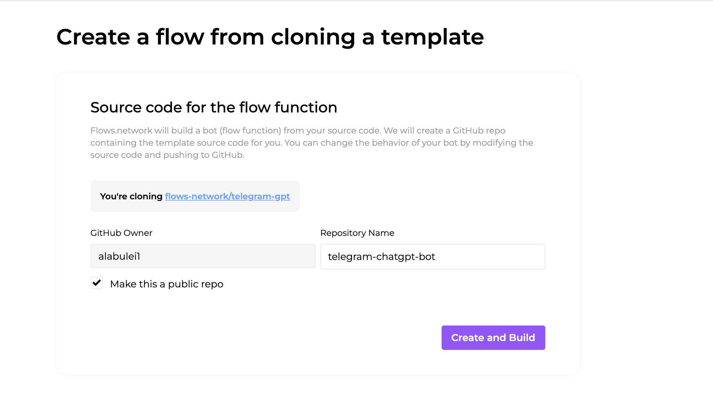
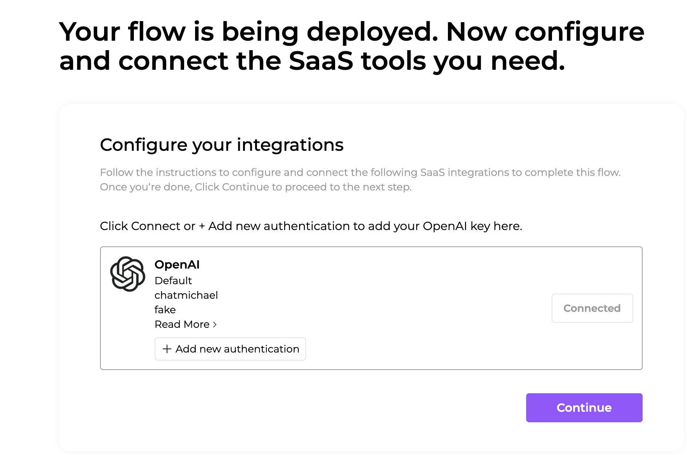
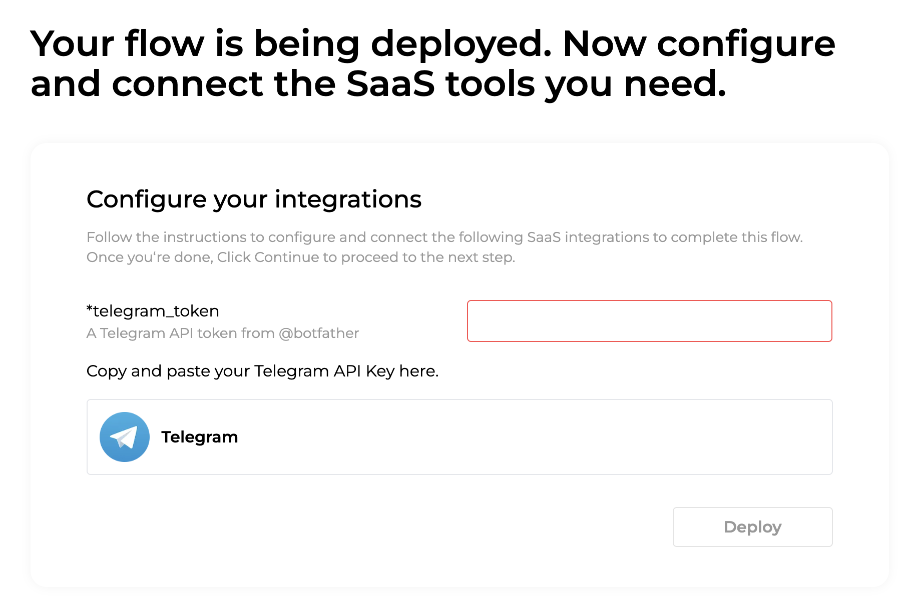
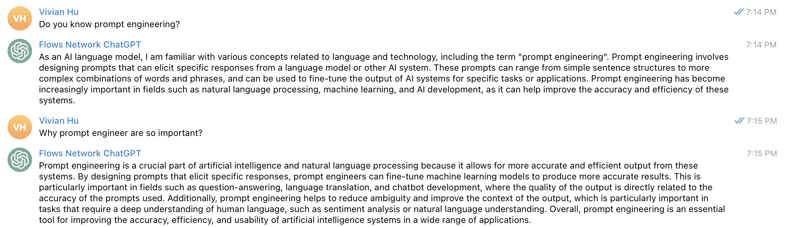
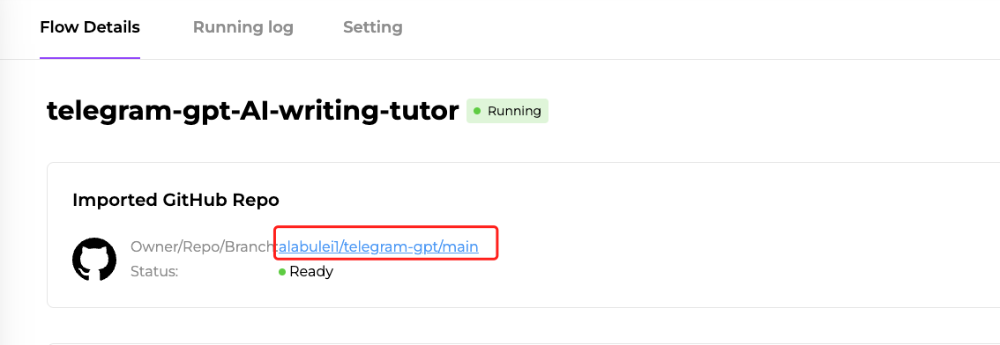

ChatGPT has taken the world by storm. However, it's desktop web browser UI is cumbersome and delivers a subpar conversation experience for users. Users already have messaging apps they love and use. We should bring ChatGPT to messaging apps and enable users to converse with ChatGPT anytime anywhere. 

Telegram is a popular messaging app that allows users to securely send messages, files, and media to individuals or groups. In this article, I will walk through how to build a ChatGPT bot on Telegram. I will further discuss how to customize your bot with your own prompts and how to access external services from the bot (ie similar to ChatGPT plugins in the desktop web UI). 


> The bot is deployed on flows.network, [a serverless platform for automating SaaS workflows with AI workloads](https://flows.network/).


## What is a telegram bot

Before we started, let’s first understand how a telegram bot works. If you are familiar with Telegram bots, you can skip this part and go to the next part to [create a ChatGPT telegram bot](#create-a-general-chatgpt-telegram-bot-from-a-flow-template-in-3-minutes).

Essentially, a Telegram bot is a software application that runs inside the Telegram app. It allows us to interact with it using text messages or commands. Telegram bots are built using APIs, which enable developers to create custom code to handle different types of messages and perform various actions.

You can use telegram bot to automate repetitive receptive tasks, such as send a welcome message to the new member. You can also integrate telegram with other SaaS. This is what exactly we are doing right now — integrate Telegram with ChatGPT. 

## Create a general ChatGPT Telegram bot from a flow template in 3 minutes

With ChatGPT's integration on Telegram, you can easily communicate with ChatGPT without the need to open an additional browser. This feature provides a convenient way to seek assistance from ChatGPT using Telegram's interface.


> Make sure you have signed up for an account for [flows.network](https://flows.network/).


1. Load [the ChatGPT based Telegram bot template](https://flows.network/flow/createByTemplate/telegram-chatgpt-bot) and click on the Create and Build button. The template contains the source code for the bot itself. flows.networl will clone the source code to your own GitHub account so that you can modify and customize it later. We will use the code to combine awesome prompts with this telegram bot.



2. **Give the bot your OpenAI API key.** Click the Connect button to add your OpenAI API key. If you have saved API keys in the past, you can skip this step and reuse these keys.



3. **Configure the Telegram API token**. This is to connect the function with your bot. You can [get a telegram API token](https://flows.network/blog/how-to-get-a-telegram-bot-token) from @botfather and paste the box here. Once you're done, the grey Deploy button will turn purple.




That’t it. After the function is ready and the status of flow is running, you can give your own ChatGPT Telegram bot a try. You can ask this ChatGPT Telegram bot to polish your english writing, being a writing tutor, and explain the code with different prompts.




## Advanced: Import awesome ChatGPT prompts to your telegram bot

The ChatGPT prompts marketplace is another hot topic with the fire of ChatGPT. Prompting is critical for getting more accurate and efficient output from the language model. This is particularly important in fields such as question-answering, language translation, and chatbot development, where the output quality is directly related to the accuracy of the prompts used. A well-written prompt is an essential tool for improving the accuracy, efficiency, and usability of artificial intelligence systems in a wide range of applications. We have seen lots of ChatGPT prompts marketplace on the market, like the open-sourced [awesome-chatgpt-prompts](https://github.com/f/awesome-chatgpt-prompts) GitHub repo, [AwesomeChatGPT,](https://www.awesomegptprompts.com/) [FlowGPT](https://flowgpt.com/) and so on.

In this section, I will show you how to add your favourite prompts to the ChatGPT Telegram bot you just built. The customized ChatGPT Telegram bot can be fine-tuned for a specific task. Here I use a prompt from AwesomeChatGPT.

> I want you to act as an AI writing tutor. I will provide you with a student who needs help improving their writing and your task is to use artificial intelligence tools, such as natural language processing, to give the student feedback on how they can improve their composition. You should also use your rhetorical knowledge and experience about effective writing techniques in order to suggest ways that the student can better express their thoughts and ideas in written form.

To achieve this goal, we need to change the source code of the repo we created for you in the above step. You can find the GitHub repo address from the flow details page. 

 
 
Then go to the `src` file of your source code repo and replace the existing ChatGPT prompt “You are a helpful assistant answering questions on Telegram” with any of the ChatGPT prompt you need in [line 22](https://github.com/flows-network/telegram-gpt/blob/main/src/lib.rs#L22). 

Before:

```
let system = "You are a helpful assistant answering questions on Telegram.\n\nIf someone greets you without asking a question, you can simply respond \"Hello, I am your assistant on Telegram, built by the Second State team. I am ready for your question now!\"";
```

After:

```
let system = "I want you to act as an AI writing tutor. I will provide you with non-native english speakers who needs help improving their writing and your task is to use artificial intelligence tools, such as natural language processing, to give the student feedback on how they can improve their composition. You should also use your rhetorical knowledge and experience about effective writing techniques in order to suggest ways that the student can better express their thoughts and ideas in written form. \n\nIf someone greets you without asking a question, you can simply respond \"Hello, I am your assistant on Telegram, built by the Second State team. I am ready for improving your English writing now!\"";
```


After making the necessary changes, push them to the GitHub repository and flows.network will automatically build your function. Once the build is complete, you will receive a customized ChatGPT Telegram bot for your specific use, eliminating the need to prompt ChatGPT when you strat a new conversation.


## Access external web services

The flow function behind the bot has access to the web. That allows the Telegram to use the latest information and web services injunction with ChatGPT. In another word, you can build ChatGPT plugin-like functionalities into your own bot. [This example](https://github.com/flows-network/weather-lookup/blob/main/src/lib.rs) shows how to make HTTPS requests to an external web service to look up the current weather and parse the result from the response JSON data. 


```
fn get_weather(city: &str) -> Result<ApiResult, String> {
    let mut writer = Vec::new();
    let api_key = std::env::var("API_KEY").unwrap();
    let query_str = format!(
        "https://api.openweathermap.org/data/2.5/weather?q={city}&units=metric&appid={api_key}"
    );

    request::get(query_str, &mut writer)
        .map_err(|e| e.to_string())
        .and_then(|_| {
            serde_json::from_slice::<ApiResult>(&writer).map_err(|_| {
                "Please check if you've typed the name of your city correctly".to_string()
            })
        })
}
```


Combining ChatGPT with the web, your Telegram bot could be the conversational UI for complex applications. You can also call external web services to perform real world actions — for example, you could call the Twilio API to make a phone call based on ChatGPT outputs. 


## What’s next?

With flows.network, you can create a ChatGPT-powered Telegram bot in just three minutes. You can personalize your bot by making changes directly to the bot’s source code. For example, you can  customize it with your favorite prompts or use external web services to provide additional context or to perform real world actions.

What are you waiting for? [Give it a try](https://flows.network/flow/createByTemplate/telegram-chatgpt-bot) today! Feel free to join our [Discord server](https://discord.gg/ccZn9ZMfFf) to stay updated or to provide feedback.


