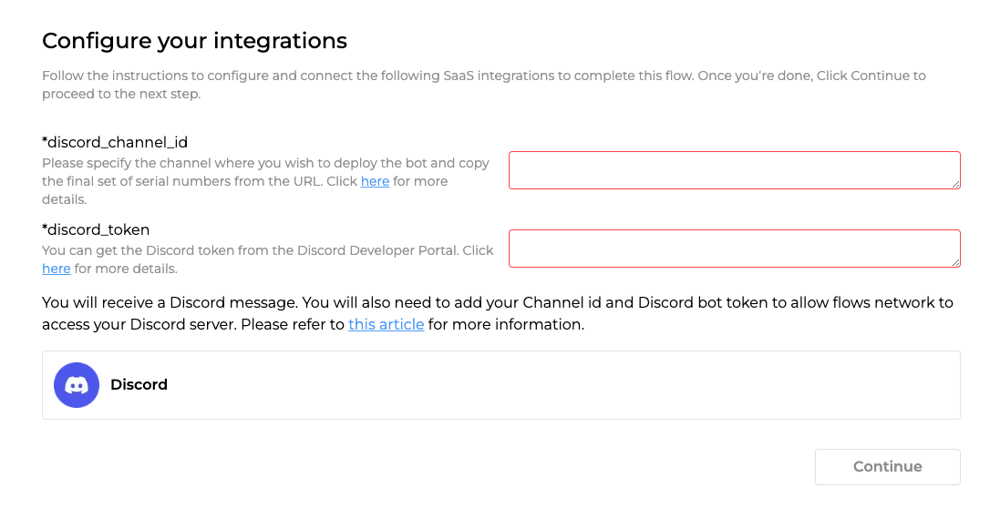

# How  to create a Discord channel bot

Discord is a great communication tool for the community. Lots of organizations, companies, and open-source projects use Discord as the home of their community. One of the most famous use cases is Midjounry. Lots of people use Midjourny to generate unbelievable images with the help of a Discord bot. In this article, I will show you how to create a Discord channel bot that can send and receive messages from an external service to a Discord channel. To connect a Discord channel on flows.network, you need two parameters: `discord_channel_id` and `discord_token`. 

## How to get the Discord channel id

Let's get started with channel id, which is much easier. Discord channel id is an 18-digit number. 


Each channel has its own unique URL. A standard URL of a discord channel is made up of `discord.com/channels/numbers/discord_id`. All you need to do is to enter the channel where you want to deploy the bot and copy the last numbers of the URL. 

```
https://discord.com/channels/846973236280950824/846973236280950827
                                               |---channel id-----|
```

That's how we get the Discord channel id. You can use a Discord channel ID to indicate the channel from which the bot should exit.


## How to get the Discord bot token

1. Go to the [Discord Developer Portal](https://discord.com/developers/applications) You need to log in your Discord account first.
2. Click on the "New Application" button and give your bot a name.
3. Then, you will be redirected to the application details page. On the general information page, you can update your app icon, description, tags and other stuff.
4. Click on the "Bot" tab on the left-hand side of the page. In this page, we need to 
    1. Click the Reset Token button to get the Discord bot token. Then save the token carefully, which we will use to build a flow on flows.network.
    2. Open the PRESENCE INTENT, SERVER MEMBERS INTENT, and MESSAGE CONTENT INTENT.
5. Click on the "OAuth" tab on the left-hand side of the page and click on URL Generator.
    1. On the URL Generator page, select "bot" scope.
    2. Select the "administrator" permission (or select message reading and sending permissions individually as you need).
    3. Copy the bot URL from the GENERATED URL in the bottom of this page. This URL is used to invite your bot to your Discord server after your flow is running successfully.

After you get the Discord Chanel id and Discord bot token, go to flows.network to create a Discord bot, like the ChatGPT Discord server.


## Connect the channel id and Discord token with your bot

The easiest way to create a discord bot is to get started with a pre-built template. Let's take the [GitHub Issue Tracker template](https://flows.network/flow/createByTemplate/github-issue-notification-tracker) as an example. After you complete the first step: create and build the flow, you'll be redirected to a page where you need to configure the Discord settings. As you can see from the image below, we need to fill in the Discord channel id and Discord bot token.





When you finish all the steps and your flow turns running, you can invite the bot to your server by the bot URL you just got in the previous step.

