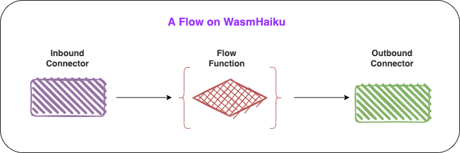

# What is a flow

Flow in WasmHaiku means a workflow that connects two SaaS APIs. First, a flow is triggered by an event from the inbound SaaS connector. Then the flow function processes the event. In the end, the flow then calls the outbound SaaS to connect to perform an action. 

A flow is the process of "if something changes, then do something". For example, if this new GitHub issue is assigned to me, then add this GitHub issue to my notion to-do list.

WasmHaiku has three modules for users to make a automated workflow.

* ➡️ An **inbound connector** acts as a webhook server for a SaaS. It receives events from the SaaS and triggers the flow function.
* ➡️ An **outbound connector** takes the output from the flow function and invokes an API call on the outbound SaaS.
* ↔️ The **flow function** takes the data from the inbound connector and creates the API call requests and send to the outbound connector. 

The following image shows a complete flow.

Now you know how WasmHaiku works. 

