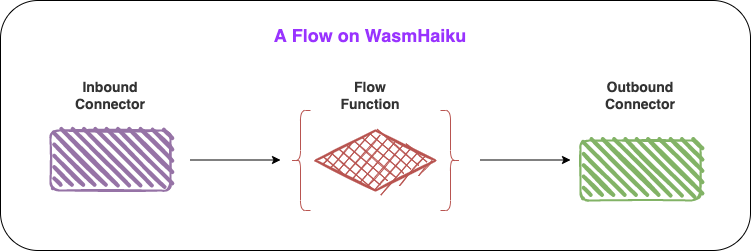

# What is a flow

A WasmHaiku flow is a custom business application that connects two or more SaaS APIs. For example, the flow could be triggered by an event in GitHub (inbound SaaS). It processes the event according to the application’s business logic, and then sends the result to a Slack channel (outbound SaaS). A flow has three components. 

* ➡️ An **inbound connector** acts as a webhook server for a SaaS. It receives events from the SaaS and triggers the flow function.
* ↔️ The **flow function** is the business application that takes the data from the inbound connector, processes it, and returns a value for the outbound connector.
* ⬅️ An **outbound connector** takes the output from the flow function and invokes an API call on the outbound SaaS to perform an action.

The following image shows a complete flow.

Now you know how WasmHaiku works. Let's get started with a flow.

