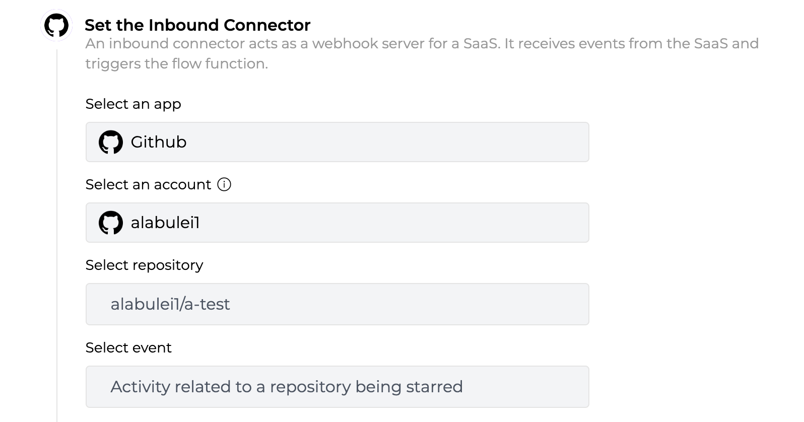
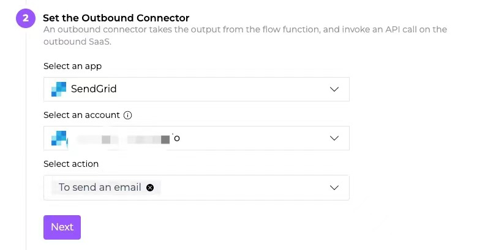
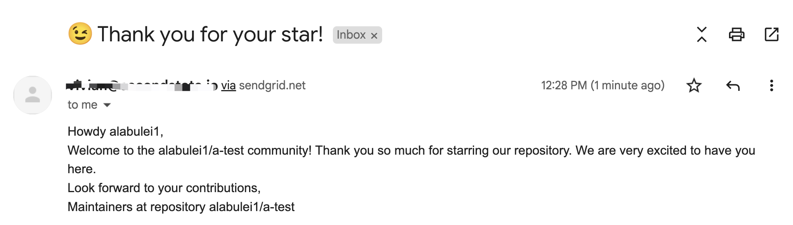

# DevRel automation with GitHub

GitHub is a great platform for companies and open source projects to build a developer community. A best practice for community building is to immediately respond to new users and contributors when they first engage your projects with new stars, forks, issues and PRs. But that typically requires dedicated community managers in all time zones. DevRel is hard! It is a task that is ripe for automation!

A GitHub bot can act as the community manager and respond to the users in a very timely and consistent way across all scenarios. However, the traditional approach to create a GitHub bot requires developers to set up a webhook server and to interact with the GitHub web API directly (eg to explicitly authenticate every request).

[Flows.network](https://flows.network/) provides a serverless platform for developers to create and automate github workflows. You can simply program the DevRel responses into a flow function. In this tutorial, I will give a concrete example in Rust. 


### The use case

One of the best windows of opportunity to engage open source users is immediately after they add a GitHub star to the repo. GitHub users star a repo for a variety of different reasons. Sometimes they want to express their appreciation to the project team. Sometimes they just want to bookmark the repo for later study. The user explicitly and publicly expressed interest in the project through the star. Why not strike a follow up conversation with the user right then and there?

In this use case, the team want the GitHub bot to automatically sends a welcome email to every developer who stars the repo. The welcome email could point to documentation or getting started guides, highlight issues that needs help, ask the user to follow social media, and even offer swags or awards to promote further engagement. The welcome email subject and text should be determined by the project team. 


### The solution

We could create an automated workflow on flows.network that sends a welcome email to a GitHub repo is starred.


> I assumed that you have basic knowledge of the concepts of the flows.work. If not, please check out [Getting Started](/docs/category/getting-started) first.


We select GitHub as the inbound connector and authenticate it's access to flows.network. It is triggered by “activity related to a repo being starred”. The following figure shows how to configure the inbound connector on flows.network.




The outbound connector is Sendgrid, a popular email service provider.  We also need to authenticate it's access to flows.network. The action is to send an email**.** The following figure shows how to configure the outbound connector.



Next, upload the Rust serverless function to flows.network. [The complete code](https://github.com/second-state/flow-functions/tree/main/github/sendgrid/star-thanks-by-sendgrid/rust) is on GitHub. The function retrieves the user’s **public email on GitHub profile**, and composes a custom message. It returns the email recipient, subject and body in a JSON string that can be processed by the outbound Sendgrid service. 


> The Rust code needs to be complied to Wasm file before uploading. Refer to [this article](https://docs.flows.network/docs/getting-started/rust/understand-the-flow-function-in-rust) for more details.


```
#[wasmedge_bindgen]
pub fn run(s: String) -> String {
    let result: Result<Value> = serde_json::from_str(s.as_str());

    if let Ok(pl) = result {
        match &pl["sender"]["email"] {
            Value::String(email) => {
                // ensure event is star or unstar
                if pl.get("starred_at").is_some() {
                    if let Some(action) = pl["action"].as_str() {
                        let sender = pl["sender"]["login"].as_str().unwrap();
                        let repo = pl["repository"]["full_name"].as_str().unwrap();

                        let subject: String;
                        let content: String;

                        if action == "created" {
                            subject = " 😉 Thank you for your star!".to_string();
                            content = format!(
                                r#"
Howdy {},<br/>
                                
Welcome to the {} community! Thank you so much for starring our repository. We are very excited to have you here.<br/>
Look forward to your contributions,<br/>
Maintainers at repository {}"#,
                                sender, repo, repo
                            );
```


Finally, click on the enable button to start listening for events and webhook calls from the inbound connector (ie Github Star events).  

That's it. The figure below shows the result. The user receives a email notification on the public email address in his Github profile after he stars your repo.



### Next steps

The above example only shows a simple use case. Since the flow function on flows.network can make web services requests and access databases for persistent storage, you can do a lot more by writing code!


* Customize the email message based on the user’s GitHub profile data (eg long time user vs new user).
* Customize the email message if the user had starred other repos in your organization.
* If a PR from a new contributor is merged, send him/her a thank-you email. 
* Send a Slack message to the DevRel channel every time you got 10 new stars. (This requires changing the outbound connector to Slack)
* If a new contributor sends a PR with a DCO signature, you could send an email to the email address he/she signed off with.
* If a new user raised an issue, send this issue to the community Discord channel. (This requires changing the outbound connector to Discord)
* and many more

We will add more examples soon. Stay tuned. If you have ideas to share with us, don't hesitate to let us know by filling in [this form](https://forms.gle/2V7RvpUK4BGQrBUZ6).


