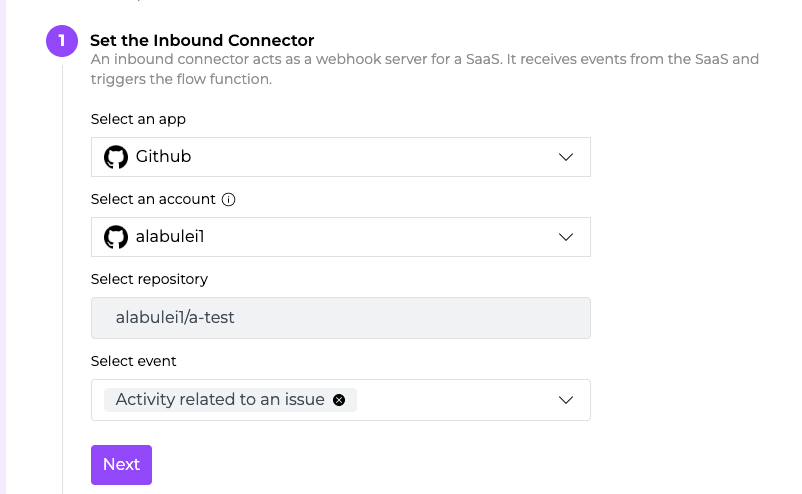
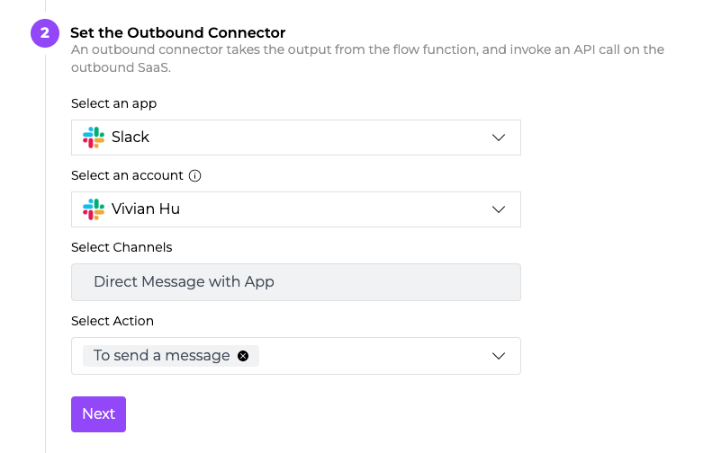
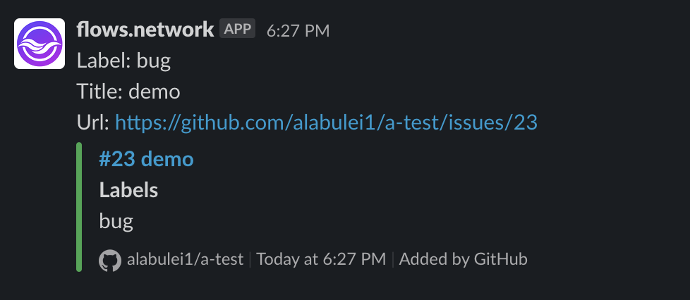

# Reduce alert fatigue through GitHub notification triage


For many software developers, being bombarded by email notifications from GitHub is a frustrating yet common experience. The alert fatigue is real. The asynchronous nature of email also encourages the developer to ignore the excessive notifications, resulting in missed notifications and opportunities.

GitHub bots can filter GitHub Issues notifications based on criteria such as labels, assignees and comments. It could then send those filtered notifications to different Slack channels instead of an email address. However, the traditional approach to create a GitHub bot requires developers to set up a webhook server and to interact with the GitHub web API directly (eg to explicitly authenticate every request).

[Flows.network](https://flows.network/) provides a serverless platform for developers to create SaaS automations and bots. You can simply upload the issue filtering logic in a function. In this tutorial, I will give a concrete example in JavaScript. 


### The use case

When a user raises an issue and labels that issue `bug`, we often want a dedicated support team to be notified immediately.

For many organizations, the support team often hang out in a Slack channel (eg a `#bug` channel).  

So, our use case is to automatically forward all `bug` labeled issues to the `#bug` slack channel.  

### The solution

We could create an automated workflow on flows.network that sending GitHub issues with `bug` label to Slack #bugs channel.


> I assumed that you have basic knowledge of the concepts of the flows.work. If not, please check out [Getting Started](/docs/category/getting-started) first.


We select GitHub as the inbound connector and authenticate it's access to flows.network. It is triggered by “activity related to an issue”. The following figure shows how to configure the inbound connector on flows.network. 



The outbound connector is Slack. The action is to send a message in a channel or a direct message. It depends on your needs. The following figure shows how to configure the outbound connector.

 

Next, upload the JavaScript serverless function to check if the issue has the `bug` label. The complete code is below. You could also download the code [here](https://github.com/second-state/flow-functions/blob/main/github/discord/issue-to-discord/bug_issue_filter.js).


```
(s) => {
    let x = JSON.parse(s);
    if(x["issue"]["labels"][0]["name"] == "bug")
        return  "Label: "+x["issue"]["labels"][0]["name"]+"\n"+
                "Title: "+x["issue"]["title"]+"\n"+
                "Url: "+x["issue"]["html_url"];
    else
        return "";
}
```


It's easy for you to further customize issue notification workflows based on the above example. You could change the label name or use more than one label to filter the notification.
 
Finally, click on the enable button to start listening for events and webhook calls from the inbound connector (ie Github issue events).  

That's it. The figure below shows how the complete flow works. You get a Slack alert message with the issue title and issue URL when the `bug` label is added to an issue.

 


### **Next steps**

The above examples only show a simple use case. Since the flow function on flows.network can make web services requests, you can do a lot more by writing code! 

* If the issue is assigned to me, then add this issue to my to-do list on Notion or JIRA.
* If the issue is labeled with `good first issue`, then send the issue to the `contributor` channel in Slack or Discord.
* If the issue description matches a template, then send the issue to the `maintainer` channel in Slack.
* If a sentiment analysis of the issue description shows that it is urgent, then text me via Twilio.
* and many more ...

If you have other great ideas to share with us, don't hesitate to let us know by filling out [this form](https://forms.gle/2V7RvpUK4BGQrBUZ6).


