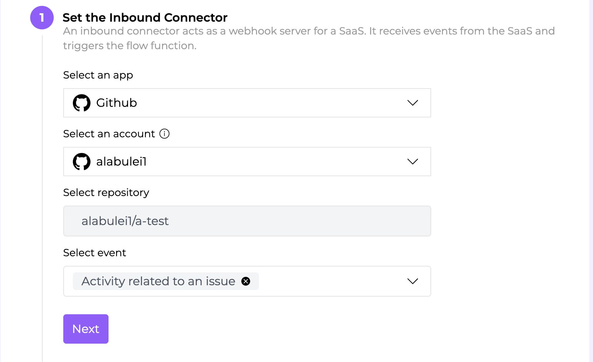
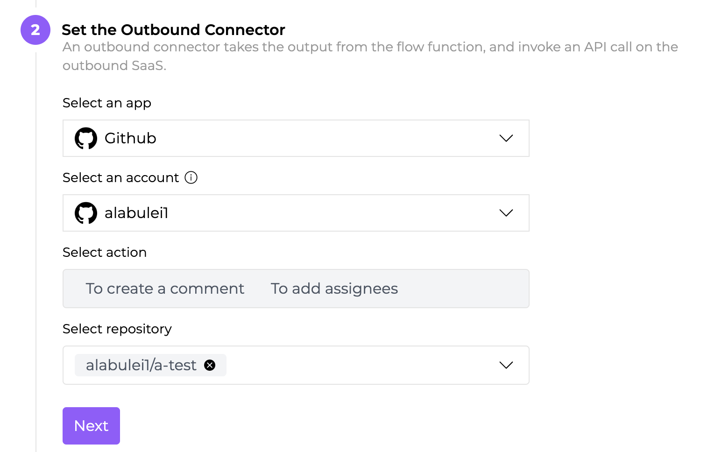
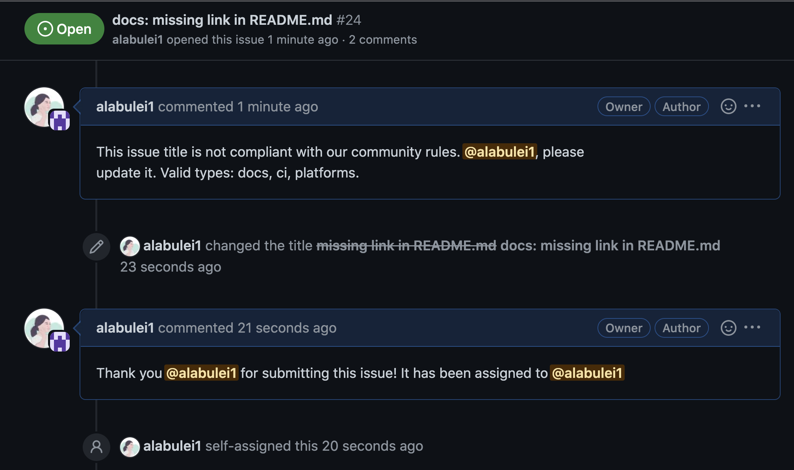

# Streamline and automate GitHub Issue responses

GitHub issues is an important channel for software development teams to receive product feedbacks, feature requests, and bug reports from users. A typical workflow of an issue starts from a review from the project owner or lead developer. If the issue is valid, it will be tagged (categorized), scheduled and assigned to a developer on the team. The developer then work on it, update it, and create a PR to close the issue.

The issue tracker is the focal point of the entire software development team. GitHub bots can automate the issue review workflow and improve the team’s productivity and response time. However, the traditional approach to create a GitHub bot requires developers to set up a webhook server and to interact with the GitHub web API directly (eg to explicitly authenticate every request).

Flows.network provides a serverless platform for developers to create github bots. You can simply upload the issue review and triage logic in a function. In this tutorial, I will give a concrete example in Rust. 


### The use case

A software development team typically standardize their GitHub issues into several categories. Each category is represented by a tag, such as `docs`, `bug`, `CI`, `paltform`, `core` and `feature request` etc. The project team could require all issues to be tagged properly in the title. For example, below is an appropriate title for a docs issue. 

Docs: missing link is a well-formed issue title.

We want to build an bot that automatically checks and validates the title. If the title does not conform to the standard format, or starts with an unknown tag, the bot will ask the submitter to change it. If the issue looks good, the bot will assign it to a designated reviewer for further triage. 


### The solution

We can create a flow function on flows.network. It is triggered by a Github Issue event, and then sends its responses back to GitHub to update the Issue. 
 

> I assumed that you have basic knowledge of the concepts of the flows.network. If not, please check out [Getting Started](docs/category/getting-started) first.


We select GitHub as the inbound connector and authenticate it's access to flows.network. It is triggered by “activity related to an issue”. The following figure shows how to configure the inbound connector on flows.network. 



The outbound connector is GitHub as well. The action is to create a comment and/or assign the issue to a reviewer. The following figure shows how to configure the outbound connector.



Next, upload the Rust serverless function to validate the issue title against our triage rules. [The complete code](https://github.com/second-state/flow-functions/tree/main/github/github/issue-review-notifier/rust) is on GitHub. 


```
    if is_compliant {
        bodies.push(format!(
            "Thank you @{} for submitting this issue! It has been assigned to {}",
            sender,
            assignees_str
        ));
    } else {
        bodies.push(format!("This issue title is not compliant with our community rules. @{}, please
     update it. Valid types: docs, ci, platforms.", sender));
    }
```


Finally, click on the enable button to start listening for events and webhook requests from the inbound connector (ie Github issue events). 
 
That's it. The figure below shows how the complete flow works. The reviewer is assigned if the issue title is valid. The bot will ask the Issue submitter to edit the title if the title doesn't meet its requirements.



### Next steps


The above example only shows a simple use case. Since the flow function on flows.network can make web services requests, you can do a lot more by writing code!


* If the issue matches the issue template, then send it to slack channel.  (The outbound connector would be Slack instead of GitHub in this case)
* Automatically assign labels based on keywords in the issue title. 
* Convert a slack message to a github issue.  (The inbound connector would be Slack instead of GitHub in this case) 
* When a  github issue is added to a milestone, then create the same issue in Jira. (The outbound connector would be Jira instead of GitHub in this case)
* and many more 


We will add more examples soon. Stay tuned. If you have ideas to share with us, don't hesitate to let us know by filling in [this form](https://forms.gle/2V7RvpUK4BGQrBUZ6).


