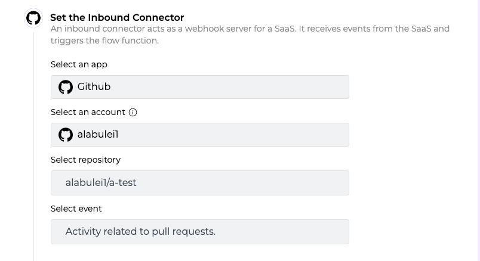
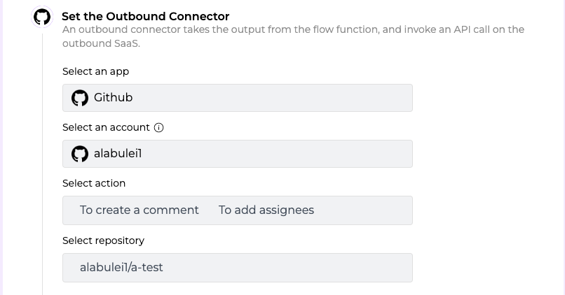
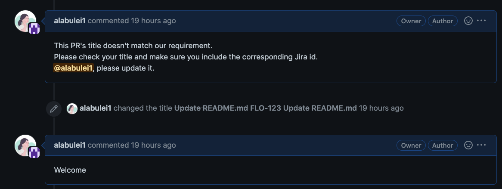

# Customize your GitHub PR Review workflow to save time and reduce errors

A Pull Request (PR) makes it easy for software developers to collaborate and discuss proposed changes to the code base. When a developer or contributor wants to make a change to the source code, s/he would open a PR that contains all proposed changes. The project’s code owners (or maintainers for open source projects) would then review the PR, discuss it in a message board, request changes, and decide if it can be merged into the code base.

Since code owners, reviewers, and fellow developers spend so much on reviewing PRs, most teams have rules to make sure that PRs follow certain formats or content guidelines. Such structured PRs can be reviewed quickly and are less error prone than free form PRs.

GitHub bots can automate the PR review workflow and improve the team’s productivity and code quality. However, the traditional approach to create a GitHub bot requires developers to set up a webhook server and to interact with the GitHub web API directly (eg to explicitly authenticate every request).

[Flows.network](https://flows.network/) provides a serverless platform for developers to create github bots. You can simply upload the PR review logic in a function. In this tutorial, I will give a concrete example in Rust. 


### The use case

A software development team uses GitHub for code repository and JIRA for issue tracking. One of its rules for PR review is that the PR title must include a corresponding JIRA ID. 


> An JIRA ID has a distinct alpha-numeric pattern. It starts with three letters followed by a sequential number starting from 1. There is a dash between the letters and numbers. For example, FLO-123 is a well formed JIRA ID.


### The solution

We can create a flow function on flows.network. It is triggered by a Github PR event, and then sends its responses back to the PR. 
 

> I assumed that you have basic knowledge of the concepts of the flows.network. If not, please check out [Getting Started](/docs/category/getting-started)  first.


We select GitHub as the inbound connector and authenticate it's access to flows.network. It is triggered by “activity related to pull requests”. The following figure shows how to configure the inbound connector on flows.network. 



The outbound connector is GitHub as well. The action is to create a comment and/or assign the PR to a reviewer. The following figure shows how to configure the outbound connector.

 

Next, upload the Rust serverless function to check if the PR title includes a valid JIRA ID. [The complete code](https://github.com/second-state/flow-functions/tree/main/github/github/check-jira-id/rust) is on GitHub. It uses regular expressions to match the pattern for valid JIRA IDs. 

> The Rust code needs to be complied to Wasm file before uploading. Refer to [this article](https://docs.flows.network/docs/getting-started/rust/understand-the-flow-function-in-rust) for more details.

```
// The PR title should be three letters-numbers description.
 let re = Regex::new(r"^[A-Za-z]{3}-\d+").unwrap();
// If the PR title doesn't match the rule, then send a message to the PR creator to update the PR title
 if !re.is_match(title) {
  bodies.push(String::from(
    "This PR's title doesn't match our requirement.",
  ));
  bodies.push(String::from("Please make sure your title includes the corresponding Jira id."));
  bodies.push(format!(
    "@{}, please update it.",
    pull_request["user"]["login"].as_str().unwrap()
  ));
// If the title meets the requirement, send a welcome message to the PR creator and assign this PR to the reviewer
 } else {
  bodies.push(String::from("Welcome"));
  assignees.insert("jetjinser");
 };
```


Finally, click on the enable button to start listening for events and webhook calls from the inbound connector (ie Github PR events). 
 
That's it. The figure below shows how the complete flow works. The reviewer is assigned if the PR title contains a valid JIRA ID.



### **Next steps**

The above example only shows a simple use case. Since the flow function on flows.network can make web services requests, you can do a lot more by writing code!


* Look up the issue on JIRA and make sure that the GitHub PR description matches the JIRA issue title.
* Automatically assign labels based on keywords in the PR title. 
* When the PR is merged, the corresponding issues in JIRA would be closed.
* If the PR receives three LGTMs from maintainers, then merge this PR automatically
* When the PR is merged, invite the PR author to join the contributors' slack channel. (The outbound connector would be Slack instead of GitHub in this case)
* and many more 

We will add more examples soon. Stay tuned. If you have ideas to share with us, don't hesitate to let us know by filling in [this form](https://forms.gle/2V7RvpUK4BGQrBUZ6).

