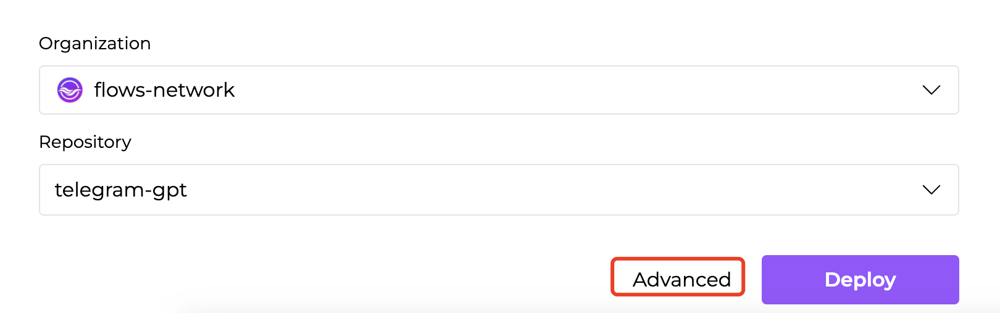
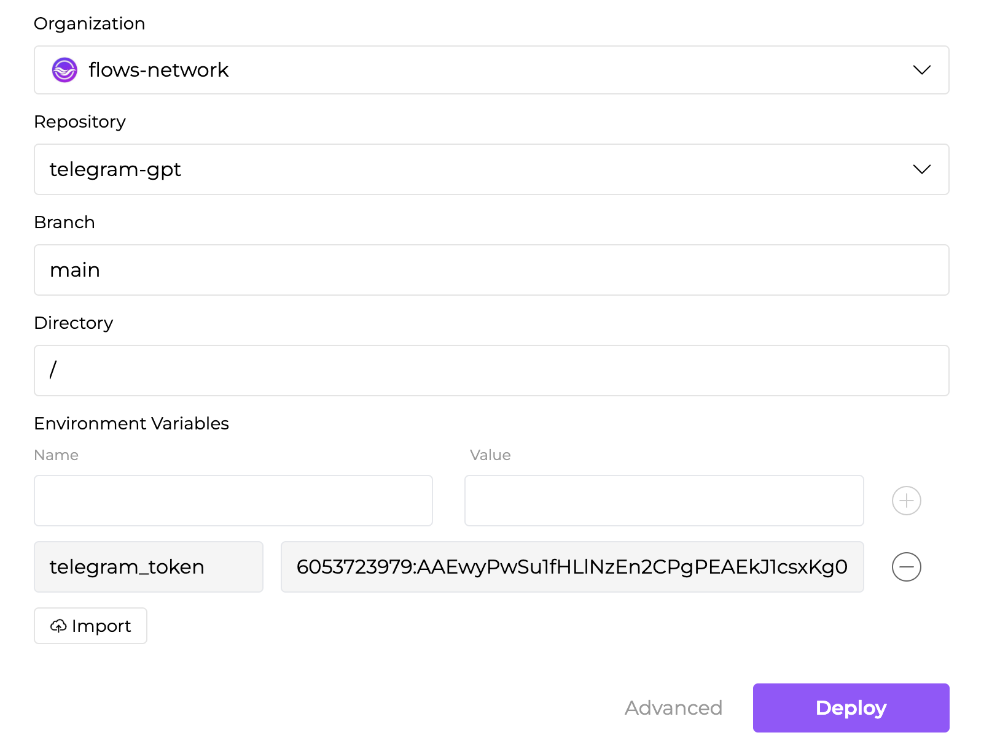
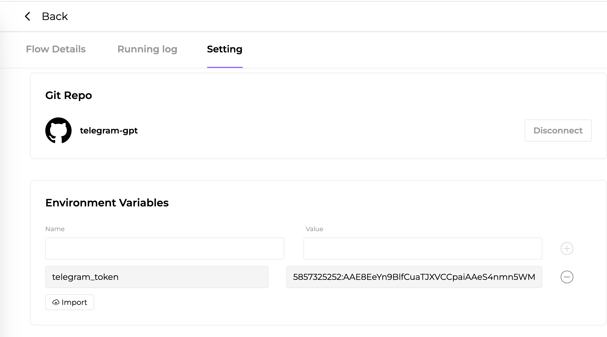

# Environment Variables

An environment variable, made up of a name/value pair, is a variable whose value is set outside flows.network. Just simply use `env::var(name)` in your code, then you could environment variable to complete the following things.

## Store your secret key

Storing the secret key provided by the SaaS platforms properly is a basic thing for flows.network. A common solution is to use environment variable to solve this problem.

See a [Telegram bot token example](https://github.com/flows-network/telegram-gpt). This example use environment variable to set up the telegram bot token.

## Pass the parameters to the function

Besides the API keys, we can also use environment variable to pass parameters to the function.

For examples, the [chatgpt-github-app](https://github.com/flows-network/chatgpt-github-app) uses variables to simplify the process of creating a new flow. In this example with Slack and OpenAI, users could use environment variable to fill in the account related information like Slack workspace, slack channel and OpenAI key. The user doesn't need to rewrite the code for this.

## How to use it

Now you have understand how to use environment variable in your code. Next, let's go through how to use environment variable when you deploy a flow function.

1. After you choose the GitHub organization and repo where your source code exists, click the Advanced text to expand the all configurations. Then you will see the Environment Variable table. You can add the environment variable here.

2. After the flow function is deployed, you could also configure the environment variable. Go to the Setting tab, scroll down, and you will see the Environment Variable table. You can add the new environment variable or delete the existing environment variable.
