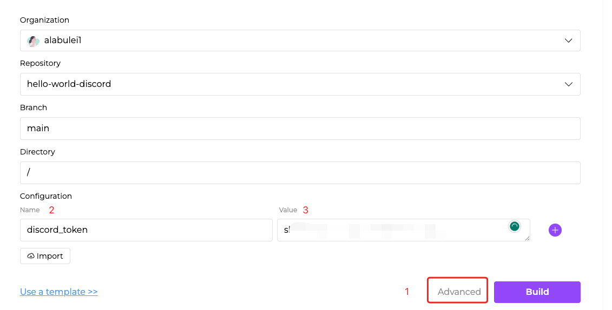
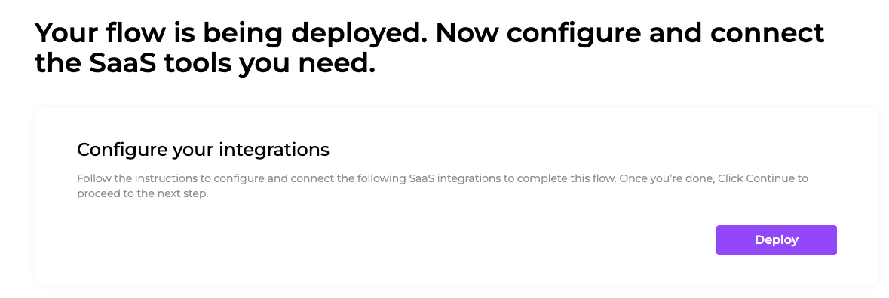
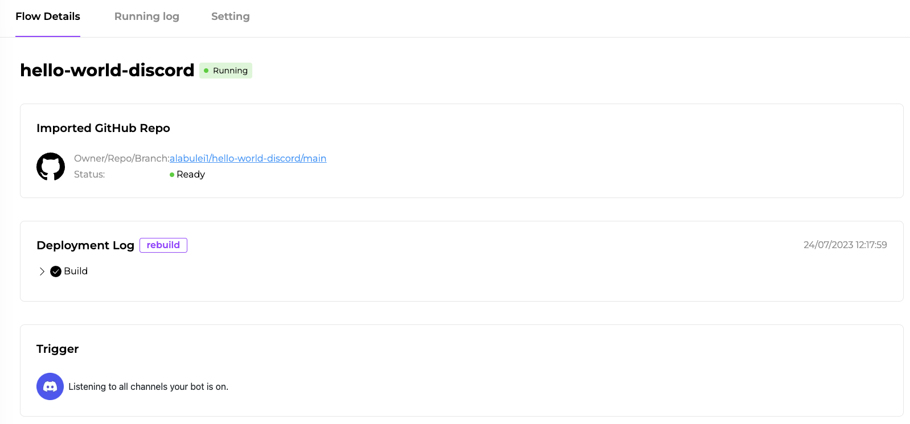
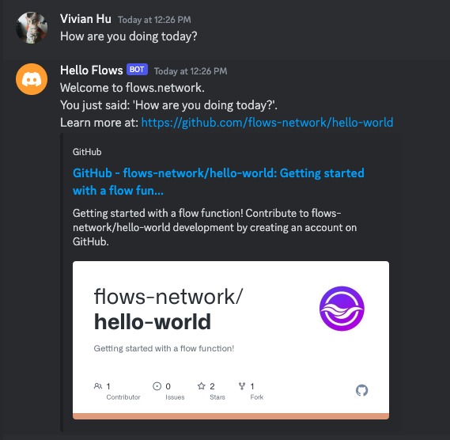

# A Hello World Discord bot

In this article, I will show you how to create a flow function that responds to events from external services. This flow function is a Discord bot.
If you send the bot a private message, it will echo the message back to you.

## Prerequisites

 1. A GitHub account to log into the [flows.network](https://flows.network/) platform. It's free.
 2. A Discord server that you have permission to add a bot.

## Prepare the source code

For this tutorial, we already created [a repo named `hello-world-discord`](https://github.com/flows-network/hello-world-discord) for you to fork.

## Import, build and deploy

[Click here](https://flows.network/flow/new) to import your forked source code repo for the flow function into flows.network.

For this flow function, we need to add a Discord token in settings so that it can listen for messages from a specific Discord bot.
Please refer to [How to create a Discord chat bot](https://flows.network/blog/discord-chat-bot-guide) on how to get your Discord token.
Click on the **Advanced** link to configure the settings.

| Name             | Value                                 |
| ---------------- | ------------------------------------- |
| discord_token    | Copied from Discord Developer Portal  |


> We put the Discord token in the settings as opposed to in the source code for two reasons. First, we keep the token secure by keeping it out of the public GitHub repos. Second, we make it easy to reuse the flow function source code.



Next, click on the **Build** and **Deploy** buttons to create the flow funtion.



Finally, you will be redirected to the flow details page, where you can check for
service status and logs.
Discord should appear as a connected external service on this page.

## Test it!

When the status of the flow is ready and running, you can invite the Discord bot to your sever.
Refer to this guide to [invite the bot to your server](https://flows.network/blog/discord-chat-bot-guide).



After the bot joined your server, you can find the bot on the right contact list and DM the bot. The bot will simply repeat what you just say.



## Code walkthrough

The source code for the flow function is written in the Rust programming language. 
The `on_deploy()` function is called by the flows.network platform when the flow is first deployed.
We create a `bot` from the `discord_token` and then call `bot.listen_to_messages()` to start up a 
listener in flows.network to listen for incoming messages from the bot.

```rust
pub async fn on_deploy() {
    let token = std::env::var("discord_token").unwrap();
    let bot = ProvidedBot::new(token);
    bot.listen_to_messages().await;
}
```

The `handler()` function is annotated with `#[message_handler]`, which is a macro defined in the Discord SDK.
It is called by the flows.network platform whenever the bot listener receives a Discord message.
The flows.network platform passes the `Message` struct, also defined in the Discord SDK, to the `handler()` function.

```rust
#[message_handler]
async fn handler(msg: Message) {
    logger::init();
    let token = std::env::var("discord_token").unwrap();
    let bot = ProvidedBot::new(token);
    let discord = bot.get_client();

    if msg.author.bot {
        log::debug!("ignored bot message");
        return;
    }
    if msg.member.is_some() {
        log::debug!("ignored channel message");
        return;
    }

    let channel_id = msg.channel_id;
    let resp = format!("Welcome to flows.network.\nYou just said: '{}'.\n", msg.content);

    _ = discord.send_message(
        channel_id.into(),
        &serde_json::json!({
            "content": resp
        }),
    ).await;
}
```

The flows.network platform retrieves the Rust source code from your GitHub repo and then compiles it for you. Of course, you can also
compile it locally by installing the Rust compiler toolchain and then run the command.

```bash
cargo build --target wasm32-wasi --release
```

## Read more

Tutorials and sample code for related flow functions. Click on the **Deploy** link to [configure and deploy your own flow without writing any code from a template](../category/getting-started-with-templates).

* Discord bot with ChatGPT [Tutorial](../bot-developer/discord-chatgpt) | [Code](https://github.com/flows-network/discord-chatgpt/) | [Deploy](https://flows.network/flow/createByTemplate/discord-chatgpt)
* Telegram bot with ChatGPT [Tutorial](../bot-developer/telegram-chatgpt) | [Code](https://github.com/flows-network/telegram-gpt) | [Deploy](https://flows.network/flow/createByTemplate/Telegram-ChatGPT)
* Slack bot with ChatGPT [Tutorial](../bot-developer/slack-chatgpt) | [Code](https://github.com/flows-network/slack-chatgpt) | [Deploy](https://flows.network/flow/createByTemplate/Slack-Chatgpt)
* GitHub comment bot with ChatGPT [Tutorial](../bot-developer/github-chatgpt) | [Code](https://github.com/flows-network/chatgpt-github-app)

