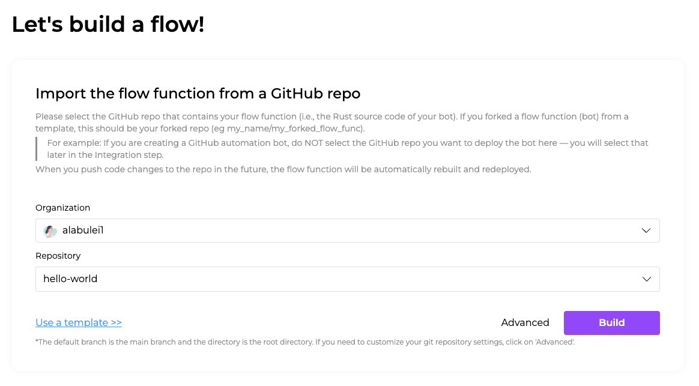
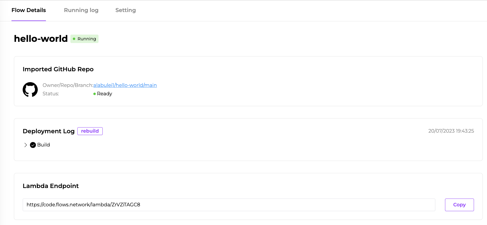

# Hello world

In this artile, I will walk you through a very simple flow function. It exposes an HTTP endpoint. You can trigger the flow function by sending an HTTP request to the endpoint, and the flow function will echo back the `msg` parameter in the HTTP response.

## Prerequisites

You will need a GitHub account to log into [flows.network](https://flows.network/). It's free.

## Prepare the source code

Flows.network makes extensive use of GitOps. It uses GitHub to store and manage the source code for all flow functions. You will need to
put your flow function's source code in a GitHub repo you have admin access to. Usually, your personal GitHub account is a good place to host your code. 
The build and deploy operations on flows.network are automatically triggered when you push changes to the code in the GitHub repo.

For this tutorial, we created [a hello world GitHub repo](https://github.com/flows-network/hello-world) for you to fork. 
Once you forked it into your personal account, let's import it into flows.network.

## Import, build and deploy 

[Click here](https://flows.network/flow/new) to import the source code for the flow function into flows.network.

Click on the **Add new authentication** button to grant flows.network access to your GitHub repos.

Next, select your own GitHub account as the Organization, and then select the hello world repo you just forked.

> If you have many GitHub repos, you can search for any specific repo in the search box.



Next, click on the **Build** button to compile and build the flow function using the source code from the selected GitHub repo.

Finally, click on **Deploy** button to deploy the flow function. You will be redirected to the flow details page, where you can check for 
service status and logs. 



On the flow details page, you can see how to trigger the flow function. In this case, it is triggered by an incoming HTTP request. 
The URL endpoint is shown on this page.

## Test it!

You can simply type an HTTP GET URL in your browser to trigger the flow function.

```
https://code.flows.network/lambda/j4DPFGufPr?msg=I+am+a+Rustacean
```

Or, you can open a terminal and send the HTTP request using `curl`.

You can enable POST requests by uncommenting the following line in the `handler()` function

```rust
let msg = String::from_utf8(body).unwrap_or("".to_string());
```

```bash
curl -X POST  https://code.flows.network/lambda/j4DPFGufPr -d "I am a Rustacean"
```

The outputs in both cases will be as follows.

```text
Welcome to flows.network.
You just said: 'I am a Rustacean'.
Learn more at: https://github.com/flows-network/hello-world
```

## Code walkthrough

The source code for the flow function is written in the Rust programming language. It is very easy to understand. The `run()` function 
is called by flows.network when it receives a trigger event. In this case, the trigger is an incoming HTTP request to the flow function's
URL endpoint.

```rust
pub async fn run() -> anyhow::Result<()> {
    request_received(|headers, qry, body| {
        handler(headers, qry, body)
    }).await;
    Ok(())
}
```

The `request_received()` function is provided by the flows.network SDK to receive the headers, query parameters, and body of the HTTP
request. It passes those data to the `handler()` function, which extracts the value for the `msg` query parameter and then sends back an HTTP
response.

```rust
async fn handler(headers: Vec<(String, String)>, qry: HashMap<String, Value>, _body: Vec<u8>) {
    let msg = qry.get("msg").unwrap();
    let resp = format!("Welcome to flows.network.\nYou just said: '{}'.\nLearn more at: https://github.com/flows-network/hello-world\n", msg);

    send_response(
        200,
        vec![(String::from("content-type"), String::from("text/html"))],
        resp.as_bytes().to_vec(),
    );
}
```

> When the flow function is deployed, the platform calls its `run()`, which calls `request_received()` for the first time. It generates a random URL endpoint and registers the flow function to be triggered by HTTP requests to that endpoint.

The flows.network platform retrieves the Rust source code from your GitHub repo and then compiles it for you. Of course, you can also
compile it locally by installing the Rust compiler toolchain and then run the command.

```bash
cargo build --target wasm32-wasi --release
```

That's it. Now you have learnt the basics of a flow function. Let's create a more useful flow function in the next chapter.
