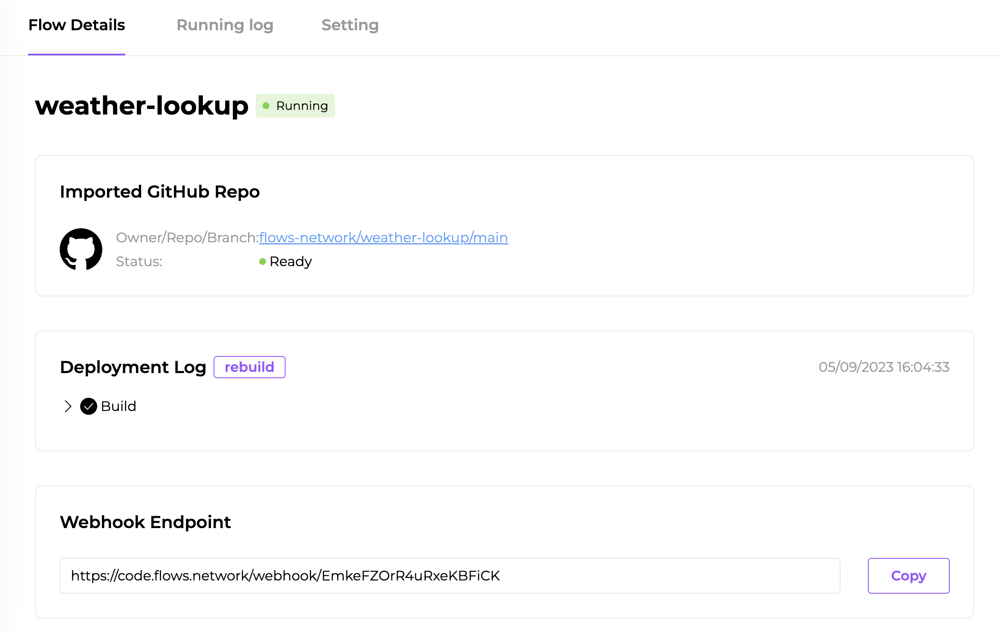

# Access external web services

In this article, I will show you how to create a flow function that responds to events from external services with the webhook flows. This flow function retrieves real-time weather data for specific cities and serves it through an asynchronous webhook endpoint. 

## Prerequisites

 1. A GitHub account to log into the [flows.network](https://flows.network/) platform. It's free.
 2. An [OpenWeatherMap API](https://openweathermap.org/api) to access the weather. 

## Prepare the source code

For this tutorial, we already created [a repo named `weather-lookup`](https://github.com/flows-network/weather-lookup) for you to fork.

## Import, build and deploy

[Click here](https://flows.network/flow/new) to import your forked source code repo for the flow function into flows.network.

For this flow function, we need to add an OpenWeatherMap API key.
Click on the **Advanced** link to configure the settings.
| Name             | Value                                 |
| ---------------- | ------------------------------------- |
| API_KEY    | Copied from OpenWeatherMap  |

> We put the API token in the settings as opposed to in the source code for two reasons. First, we keep the token secure by keeping it out of the public GitHub repos. Second, we make it easy to reuse the flow function source code.

Next, click on the **Build** and **Deploy** buttons to create the flow function.


Finally, you will be redirected to the flow details page, where you can check for
service status and logs.

## Test it!



When the status of the flow is ready and running, you can see a link under the Webhook Endpoint. Copy and paste this URL to your browser and add `?city=cityname` to look up the weather of the city  you want to know.

## Code walkthrough

The source code for the flow function is written in the Rust programming language. 

### Initialize webhook 

The `#[tokio::main(flavor = "current_thread")]` annotation indicates that this function is the program's asynchronous entry point running on current thread. In `on_deploy` function, the webhook endpoint is created and set to listen for incoming calls.

```rust
#[no_mangle]
#[tokio::main(flavor = "current_thread")]
pub async fn on_deploy() {
    create_endpoint().await;
}
```

### Handle the request
The handler annotated with `#[request_handler]` will handle the incoming HTTP request. The function first fetches the "city" query parameter, then calls `get_weather` to retrieve weather data for the specified city. 

```rust
#[request_handler]
async fn handler(_headers: Vec<(String, String)>, _subpath: String, qry: HashMap<String, Value>, _body: Vec<u8>) {
    ...
}
```
### Fetch Weather Data

The `get_weather` function makes a GET request to the OpenWeatherMap API and returns a `Result` with the weather information if successful or an error message string if not.

```
fn get_weather(city: &str) -> Result<ApiResult, String> {
    let mut writer = Vec::new();
    let api_key = std::env::var("API_KEY").unwrap();
    let query_str = format!(
        "https://api.openweathermap.org/data/2.5/weather?q={city}&units=metric&appid={api_key}"
    );

    request::get(query_str, &mut writer)
        .map_err(|e| e.to_string())
        .and_then(|_| {
            serde_json::from_slice::<ApiResult>(&writer).map_err(|_| {
                "Please check if you've typed the name of your city correctly".to_string()
            })
        })
}
```

### Data Structures

These structures are used to deserialize the JSON response from the OpenWeatherMap API:

```rust
#[derive(Deserialize)]
struct ApiResult {
    weather: Vec<Weather>,
    main: Main,
    wind: Wind,
}

#[derive(Deserialize)]
struct Weather {
    main: String,
}

#[derive(Deserialize)]
struct Main {
    temp_max: f64,
    temp_min: f64,
}

#[derive(Deserialize)]
struct Wind {
    speed: f64,
}
```
