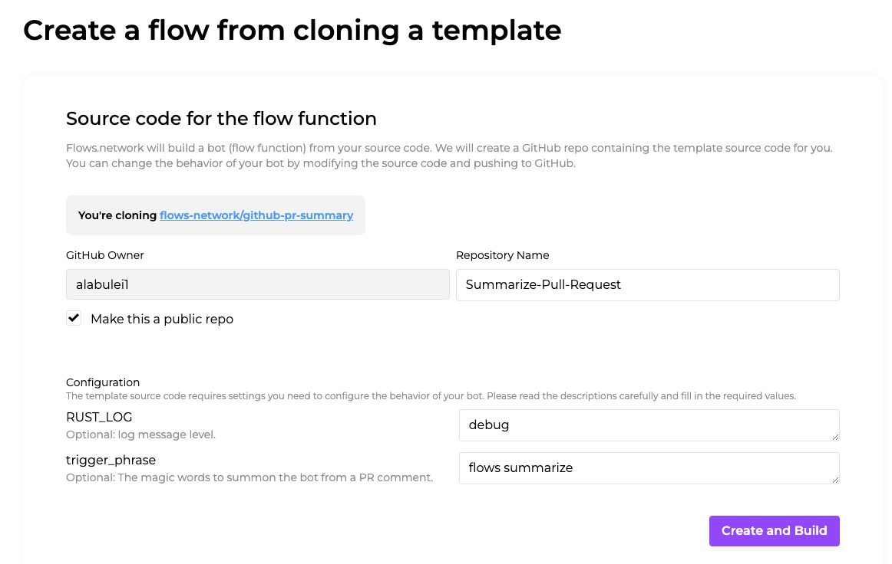
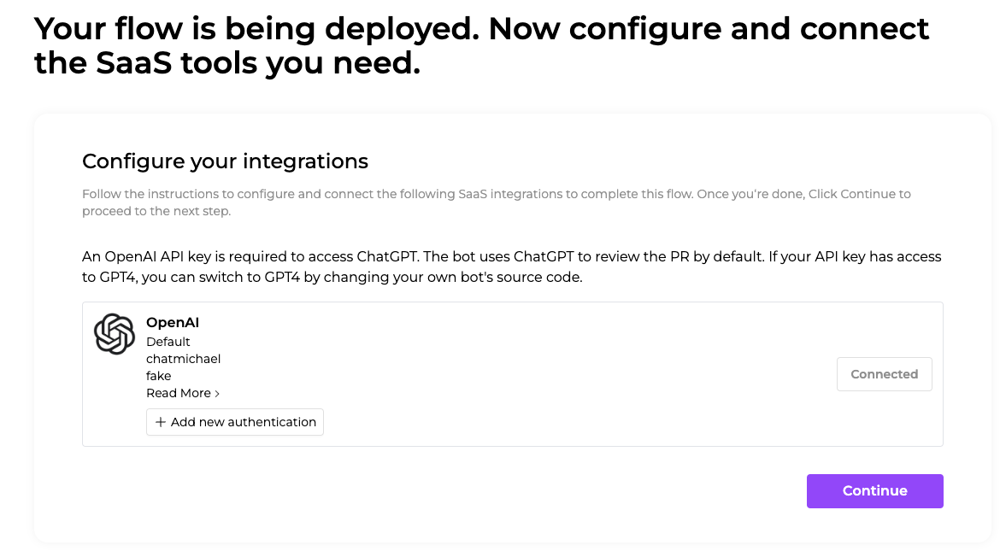
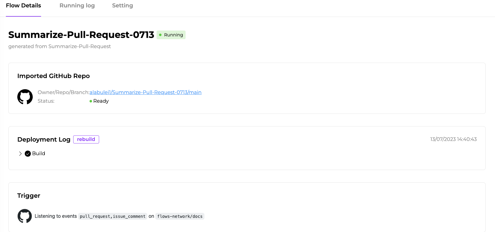

# Build a GitHub PR review bot with a template

In order to make the process of using flows.network easier for users, we have introduced pre-built flow templates. In this article, I will cover how to build a flow with a template in three steps.

## Prerequisites

1. A GitHub account to sign up for the flows.network platform, and clone the template code.
2. Sign up for the [flows.network](https://flows.network/) platform. It's free.

## Create and build

First, let's choose one template to get started. You can find all the templates [here](https://flows.network/start).

Here, we choose the [Summarize & review changes in each commit](https://flows.network/flow/createByTemplate/Summarize-Pull-Request) template, which help project maintainers to review each PR. The trigger for this template is that a new PR is raised or a magic word is commented. The action is to call ChatGPT to review the PR and send the result as a PR comment.

Click on "Create from template" to activate this template. And you will be directed to a new page.

Typically, you will find two sections on this page. First is the information for cloning the template source code under your own GitHub org. This is to ensure you have the full control of the source code. In this case, we will create a repo named `Summarize-Pull-Request` under your personal GitHub Account. You can choose this repo public or not.

The second part is the associated configurations for this template. You may need to configure the parameters according to the description under the parameters. In this case, we have two configurations. The `RUST_LOG` is to help you debug the flow, which is optional. The `trigger_phrase` is to  summon the bot from a PR comment, optional too.

After that, click on Create and Build to process the next step. Meanwhile, the flows.network will create a repo for you and build the source code of the repo we just created for you.

## Configure the SaaS integrations

Next, let's configure the SaaS integrations required by the template.

The first one is OpenAI. We need to add OpenAI key here. Click Connect  button to add your OpenAI key.

The second one is GitHub. We need to configure which repo to deploy the bot and grant flows.network to access the GitHub repo.

Enter the GitHub organization and repository name here and you will also see a preview under the boxes at the same time.

After that, Click Connect to grant flows.network to access the repo you just typed.

Once the 'Connect' button, initially in purple, changes to a gray 'Connected' button, the Deploy button in grey will turns purple. Click the purple button to complete the process.

After that, you will be directed to a new page showing the details of the flow you just created.

The page will show which template is this flow is generated from.

Once the function is ready and the flow is running, you can go to your repository and create a pull request (PR) to trigger the bot.
