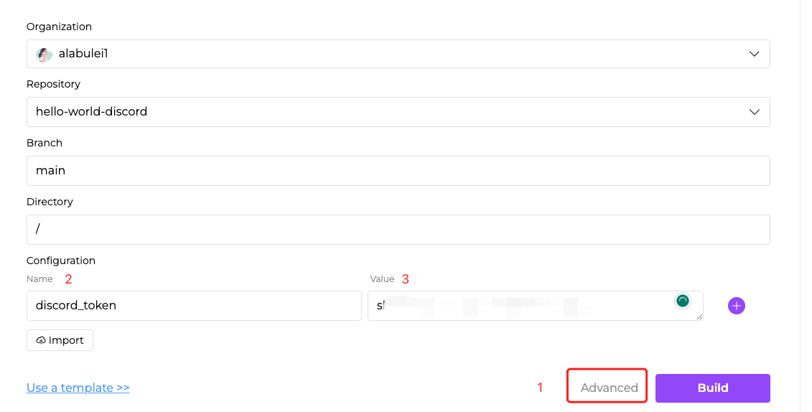
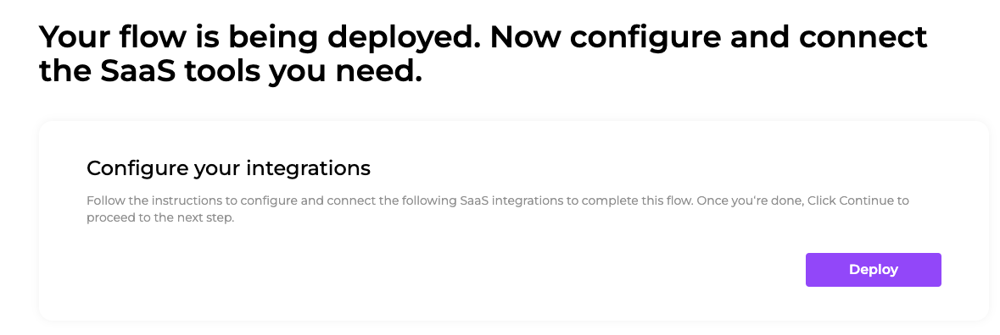
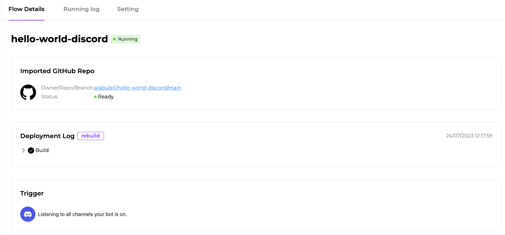
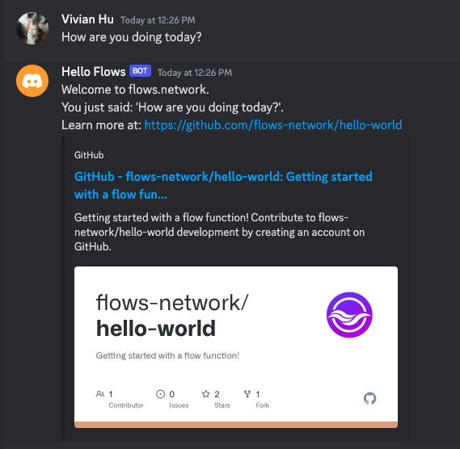

# A Hello World Discord bot

In the previous article, we have a basic understanding of [how we run a flow function on flows.network](hello-world.md). I will show you an advanced example requiring tou to configure other SaaS providers. If you send the bot "Hello world", the bot will reply to what you just said.

> We will use configurations (Add a pair of name and value) to configure Discord. 

## Prerequisites

 1. A GitHub account to sign up for the [flows.network](https://flows.network/) platform.  It's free.
 2. A Discord server that you have permission to add a bot.

## Prepare the code

Since flows.network requires users to import their flow function code from GitHub, you will need to put your source code on under a GitHub repo that you have the admin access. Usually, your personnel GitHub account is a good place to host your code. After you import the function source code, flows.network will build and deploy the source code automatically. Once you have any commits to the repo in the future, flows.network will automatically rebuild the function for you. That's why we call flows.network a serverless platform: developers don't need to care about DevOps.

For this tutorial, we already set up [a repo named `hello-world-discord`](https://github.com/flows-network/hello-world-discord) for you to fork.

## Important the source code

Open this [page](https://flows.network/flow/new) to create a flow in your browser.

You need to authenticate your GitHub account first. Click the Add new authentication to grant flows.network to access your github repo.

Then, choose your own GitHub account under the Organization part and the repo you just forked under the Repository part.

> If you have numerous GitHub repositories, you can search for your repository by entering keywords in the repository search box.

For this tutorial, we need to add a Discord token to create a bot. Click on the Advanced text to set up more settings.

You can see we can change the branch and directory of your code. And we can also add some configurations. Here we use configurations to add discord token because we can't reveal the discord token to other people.

Let's input "Name" as `discord_token`, and the value is your discord token. Please refer to [How to create a Discord chat bot](https://flows.network/blog/discord-chat-bot-guide) to get your Discord Token.

After that, click on Build to build and deploy the function.

## Configure the SaaS integration

Since we already added a Discord token, there is no need to configure Discord. We can just click Deploy to finish the flow.

## Check out the flow

After clicked Deploy button, you will be redirected to a new page where you can check out the flow details, like the status and connected integrations.

When the status of function is ready and the status of flow is running, you can invite your Discord bot to your sever.

Refer to this guide to [invite the bot to your server](https://flows.network/blog/discord-chat-bot-guide).

After the bot joined your server, you can find the bot on the right contact list and DM the bot. The bot will simply repeat what you just say.

