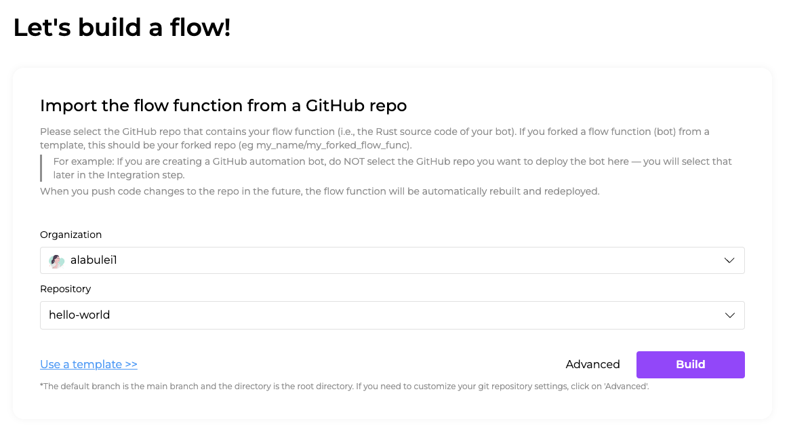
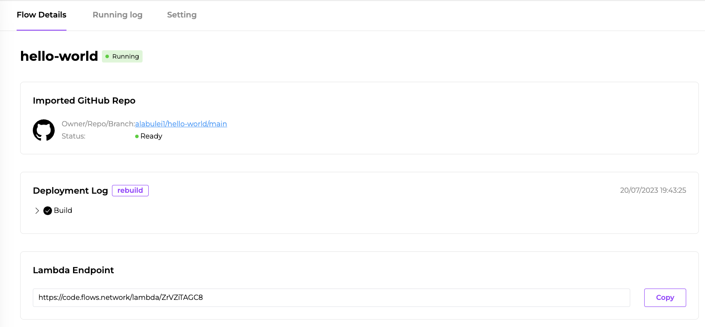

# Hello world example without any integrations

In this article, I will walk you through how to run a hello world example on flows.network. This flow function exposes a HTTP endpoint. You can submit any data to the endpoint via HTTP POST and the flow function will echo it back to you in the HTTP response.

This example is quite simple and you don't need to any SaaS integrations.

## Prerequisites

You will need a GitHub account to sign up for the [flows.network](https://flows.network/) platform. It's free.

## Prepare the code

Since flows.network requires users to import their flow function code from GitHub, you will need to put your source code on under a GitHub repo that you have the admin access. Usually, your personnel GitHub account is a good place to host your code. After you import the function source code, flows.network will build and deploy the source code automatically. Once you have any commits to the repo in the future, flows.network will automatically rebuild the function for you. That's why we call flows.network a serverless platform: developers don't need to care about DevOps.

For this tutorial, we already set up [a hello world GitHub repo](https://github.com/flows-network/hello-world) for you to fork. Once you forked successfully, let's go to the next part.

## import the source

Open this [page](https://flows.network/flow/new) to create a flow in your browser.

You need to authenticate your GitHub account first. Click the Add new authentication to grant flows.network to access your github repo.

Then, choose your own GitHub account under the Organization part and the repo you just forked under the Repository part. Then, choose your own GitHub account under the Organization part and the repo you just forked under the Repository part.

> If you have numerous GitHub repositories, you can search for your repository by entering keywords in the repository search box.



After that, click Build to build and deploy the function.

## Get the endpoint

Next, click on Deploy to proceed the flow and your wil be redirected to the flow details page. You can check the status of your function and get the endpoint URL to make a HTTP response.



Once you see the endpoint url, you can open your terminal and use the following command line to give it a try.

```bash
curl -X POST  https://code.flows.network/lambda/j4DPFGufPr -d "I am a Rustacean"
```
The output will be

```text
Welcome to flows.network.
You just said: 'I am a Rustacean'.
Learn more at: https://github.com/flows-network/hello-world
```

