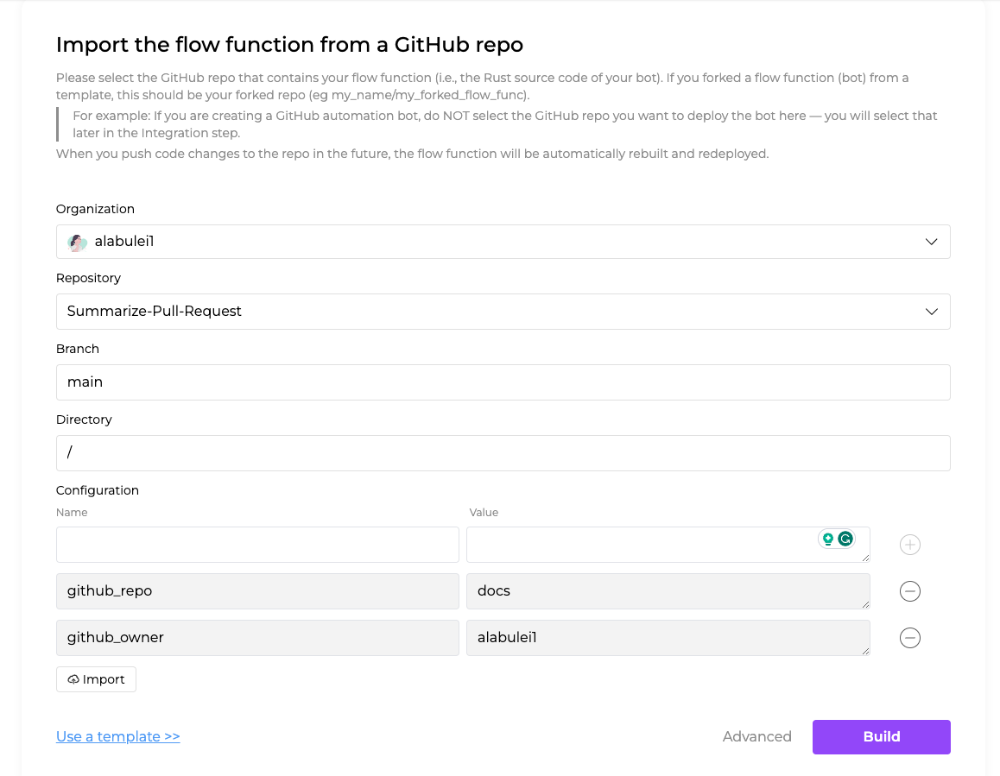

# Getting started with your own source code

While templates provide a convenient way to get started with flows.network, they may not cover all use cases. In such situations, you can create your own flow function using the wrapped SaaS SDKs and import and deploy a GitHub repository containing your custom code.

This article will guide you through the process of creating a flow by importing your own source code.

## Prerequisites

1. A GitHub account to sign up for the flows.network platform and clone the template code.
2. Sign up for the [flows.network](https://flows.network/) platform. It's free.

## Prepare your code

If you don't already have your own code, you can fork the [flows-network/github-pr-summary](https://github.com/flows-network/github-pr-summary) repository. Once you have forked the source code, you can make necessary modifications to suit your requirements. For example, you can directly specify the `github_owner` and `github_repo` values in the code.

## Import your source code

Open the [page](https://flows.network/flow/new) in your browser.

When your code is ready, follow the user interface (UI) instructions to select the repository where your source code exists.

> Tip #1: If you have numerous GitHub repositories, you can search for your repository by entering keywords in the repository search box.
> Tip #2: If you want to customize your repo, click "Advanced" to access more options. You can choose the branch, folder, and set up additional parameters.

Click "Build" to build the chosen function.

## Configure the required SaaS integration for your function

Next, you need to grant flows.network access to the SaaS integration required for this flow.

The UI will direct you to configure the necessary SaaS integration.

For the [flows-network/github-pr-summary](https://github.com/flows-network/github-pr-summary) repository, you will need to configure OpenAI and GitHub integrations.

![template-02.png]

Simply click the "Connect" button to open a new authentication page. Once you have completed the authentication process, the "Go to the Flow" button will turn purple. Click the button to complete the flow.

Afterward, you will be directed to a new page displaying the details of the flow you just created.

Once the function is ready and the flow is running, you can go to the repository and trigger the bot by creating a pull request (PR).

