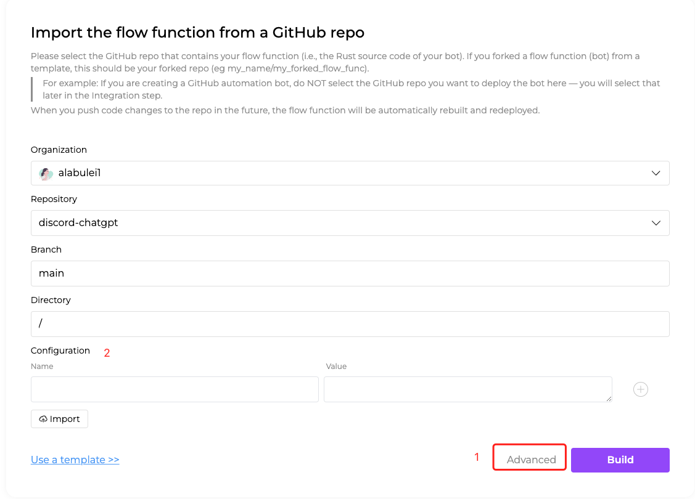

# Configurations

Configurations, made up of a name/value pair, is a variable whose value is set outside flows.network. It's very similar to environment variables. You can store your secret key and pass the parameters to the function.

## Usage

### How to use in your code

You can just simply use `env::var(name)` in your code.

```
 let owner = env::var("github_owner").unwrap();
// another example
 let owner = env::var("github_owner").unwrap_or("juntao".to_string());
```

### How to configure the configuration on a flow

Let's go through how to use the configurations when and after you deploy a flow function.

If you create a flow from a template, you just need to follow the UI instruction to enter the required configurations.

If you create a flow from importing the source code, you can click Advanced text to add configurations.



After the flow function is deployed, you can also add or delete a configuration.

Go to the Setting tab, scroll down, and you will see the Configuration table. See [Change Configurations](/docs/flow-dashboard/setting.md#change-configurations) for more information.


### Flows that using configuration feature

* [Build a Telegram ChatGPT bot](https://github.com/flows-network/telegram-gpt)

* [Chat with ChatGPT via GitHub Issues](https://github.com/flows-network/chatgpt-github-app)