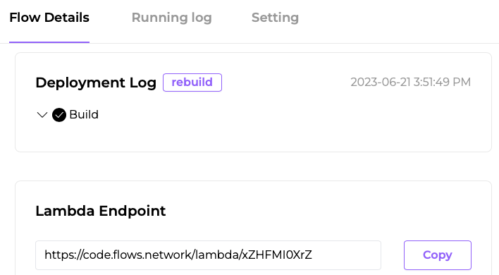

# Web service interface

The [`webhook_flows`](https://docs.rs/webhook-flows/latest/webhook_flows/) library allows you to expose your `Flows function` on the flows.network platform through the standard web interface to get data input or deliver results. Hence providing a direct interface between the platform and outside entities, like third-party services or user applications.


## Usage
### Creating a Webhook Service

In this example, we'll show you how to create a webhook service that scrapes a webpage and returns the scraped text.

Here are the steps: 
1. Open your `Cargo.toml` file and add the following lines:

```toml
[dependencies]
webhook-flows = "0.1.0" # or the appropriate version
web_scraper_flows = "0.1" # or the appropriate version
tokio = { version = "1", features = ["full"] }
``` 
2. In your Rust code, import the necessary libraries:

```rust
use webhook_flows::{request_received, send_response};
use serde_json::Value;
use std::collections::HashMap;
use tokio;
use web_scraper_flows::get_page_text;
``` 
3. Define your main function as an asynchronous function:

```rust
#[no_mangle]
#[tokio::main(flavor = "current_thread")]
pub async fn run() {
    request_received(handler).await;
}
``` 
4. Finally, create your handler function which will handle the incoming request, scrape the webpage, and return the scraped text:

```rust
async fn handler(_qry: HashMap<String, Value>, _body: Vec<u8>) {
    let url = _qry.get("url").unwrap().as_str().unwrap();
    match get_page_text(&url).await {
        Ok(text) => send_response(
            200,
            vec![(String::from("content-type"), String::from("text/html"))],
            text.as_bytes().to_vec(),
        ),

        Err(_e) => send_response(
            200,
            vec![(String::from("content-type"), String::from("text/html"))],
            _e.as_bytes().to_vec(),
        ),
    };
}
```

After you've uploaded your repository to `Flows Network` to compile, you'll get a unique URL in the Webhook Endpoint section, this is a link to your webhook function. You can now share this URL for external use.



That's it! Your webhook service is now ready. When called with an HTTP request containing a URL as a query parameter, it will scrape the webpage at that URL and return the scraped text.


## Flows that use the `webhook_flows` crate 

- [`webhook-airtable`](https://github.com/flows-network/webhook-airtable) . The `webhook_flows` crate is used to create a webhook service that collects user input from a form (Name, Notes), and sends this data to a predefined Airtable base and table.

Please note that for these services to interact with the outside world, the calling party needs to make an HTTP request to the flow function hosted on the platform. The function will process the request and return the results back to the calling party.

