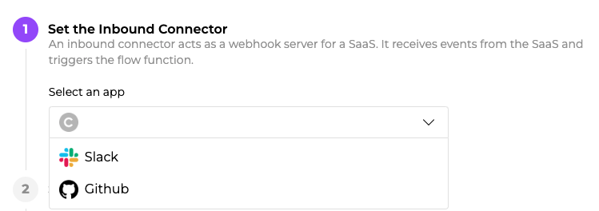
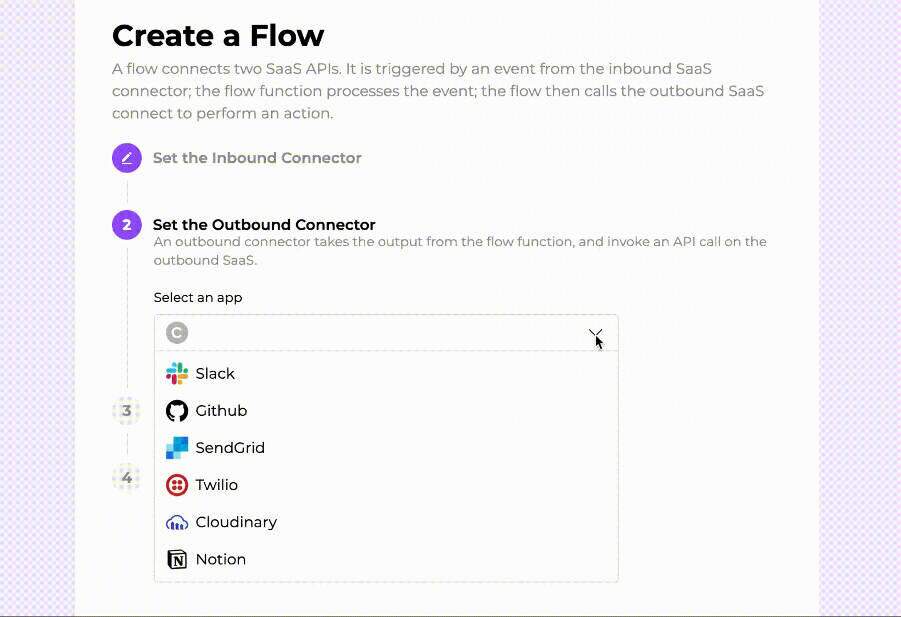
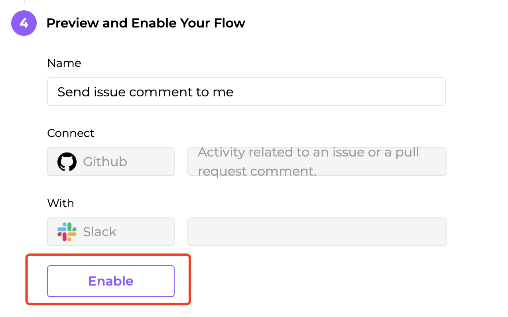

# Getting started

It only takes minutes to create a WasmHaiku flow function that ties together multiple SaaS services to create a customized business application. It is much easier than creating custom webhook servers and client applications to interact with those SaaS web APIs manually! 

> To learn the basic concepts and technical architecture of WasmHaiku, please see the [What is a Flow](/reference-guides/what-is-a-flow.md) chapter.

## The use case

Let’s say that you are a maintainer of an open source project hosted on GitHub. The project’s volunteer developers are busy but they are all in a Slack channel. Since no one really pays attention to their GitHub notification emails, you would like to make sure that important GitHub issue comments are also sent to the Slack channel.

WasmHaiku enables you to create this automated workflow with ease. But more importantly, it allows you to write software programs to customize this workflow for your own business needs. For example, your function could have logic to decide which issue comments need to be sent to Slack. Now, let's get started with a simple flow function in WasmHaiku to understand how it works.

## Before you start

For the purpose of this guide, you need an account on GitHub and Slack.

Now, make sure you have signed up for an account on [WasmHaiku](https://wasmhaiku.com/). It's free!

## Login and start

Log into your WasmHaiku account and click on the **Create a Flow** button. You will go to the create a flow page.

## Step 1: Connect the inbound connector — GitHub

You need to configure an inbound connector as the data source for the flow. In our case, the flow function is triggered by issue comments in GitHub.

Click on the **Select an App**, and you will see a list of SaaS that WasmHaiku supports. Pick Github here. 

In the next several screens, GitHub will ask you to authorize WasmHaiku to access your account, and then you will choose which GitHub API events WasmHaiku will accept (i.e, issue comment events). If you are uncertain, please watch the 1-minute video walk-through below. 

You are done with the inbound connector! If someone comments on any existing issue in GitHub repo `alabulei/a-test`, the flow function would be triggered. Let's move on to the outbound connector by clicking on the **Next** button.

## Step 2: Connect the outbound connector — Slack

You need to configure an outbound connector as the target action for the flow. In our case, the flow function triggers the Slack API to send notification messages to Slack. We choose Slack as the outbound connector. 

In the next several screens, Slack will ask you to authorize WasmHaiku to send messages on your behalf to selected channels. If you are uncertain, please watch the 1-minute video walk-through below. 

You are done with the outbound connector now! If someone comments on any issue in GitHub repo `alabulei/a-test`, the flow would send a message in Slack #everyone channel. The flow function sits between the inbound and outbound connectors and provides developers a way to create and customize the message. 

## Step 3: Upload the flow function

In this tutorial, we will first upload a simple flow function. It just parses the event message from GitHub, and then creates a message for the Slack API. If you are interested in learning how the code works, please go to the Customize the flow function section.

[Download the pre-made JavaScript file](https://github.com/second-state/flow-functions/tree/main/getting-started/javascript)) on your own computer. Click on the **Select an Attachment** to upload the JavaScript file.

Click on the **Next** button to continue.

## Enable the flow

You can rename your flow and preview the inbound and outbound connectors on this screen.

Do not forget to click on the **Enable** button to finalize your flow!

That's all! If someone comments on an issue in the connected GitHub repo, you will get an alert in Slack automatically.

