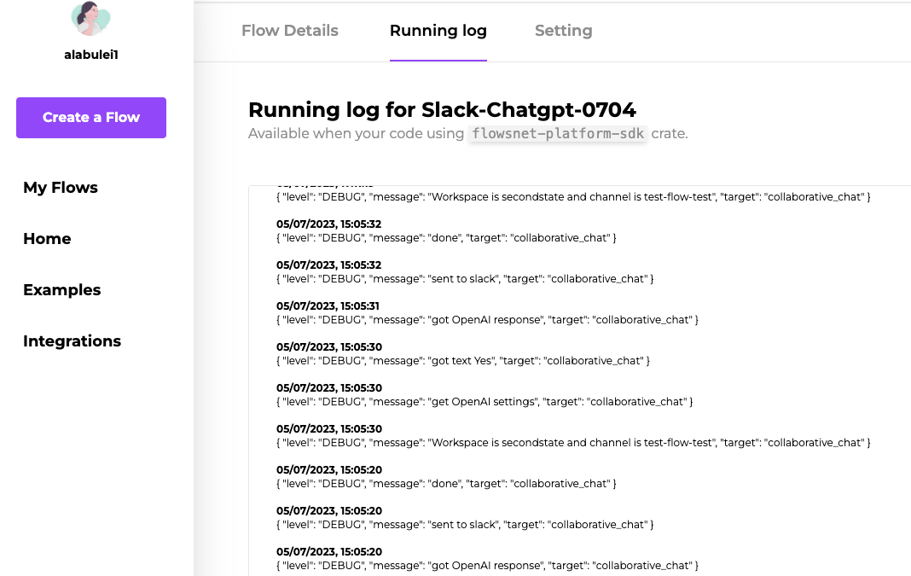
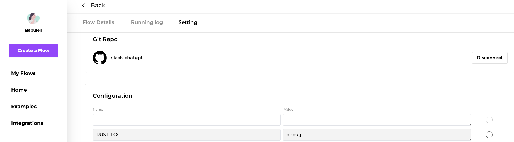

# logging

The [`flowsnet-platform-sdk` crate](https://crates.io/crates/flowsnet-platform-sdk) offers the ability to add log and debug log for flows.

## Usage

### How to add logging to your code

To add logging to your code, follow these steps:

1. Open your `Cargo.toml` file and add the following lines:
   ```
   [dependencies]
   flowsnet-platform-sdk = "0.1"
   log = "0.4"
   ```

2. In the beginning of your Rust code, ensure that you import the `flowsnet_platform_sdk` crate:
   ```rust
   use flowsnet_platform_sdk::logger;
   ```

3. Inside your `main` function, initialize the logger:
   ```rust
   pub async fn run() -> anyhow::Result<()> {
       dotenv().ok();
       logger::init();
       // Rest of your code
   }
   ```

4. Whenever you want to add log information, use the `log::debug!` macro and provide the desired message:
   ```rust
   log::debug!("Received payload: PR Synced");
   ```

That's it! Logging functionality has now been added to your code.

### Setting up the flow

All the logs will be displayed in the "Running Log" tab, as shown in the accompanying image.



To view the logs, go to the "Settings" tab and scroll down to find the "Configuration" button. Add a new configuration with the name `RUST_LOG` and the value `debug`.



Now, whenever the flow is triggered, you can see the detailed logs. Please note that the logs are only saved for the latest three days.

## Flows that using the `flowsnet-platform-sdk` crate

* [Use ChatGPT to summarize & review GitHub Pull Requests](https://github.com/flows-network/github-pr-summary). The `flowsnet-platform-sdk` crate provides detailed and long time log.

* [Integrate ChatGPT into telegram](https://github.com/flows-network/telegram-gpt). The `flowsnet-platform-sdk` crate provides detailed and long time log.
