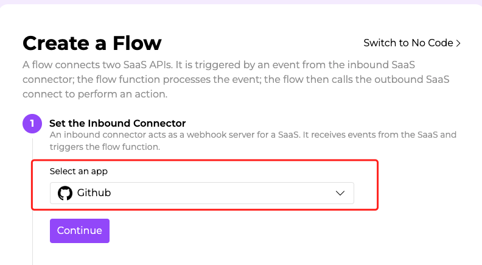
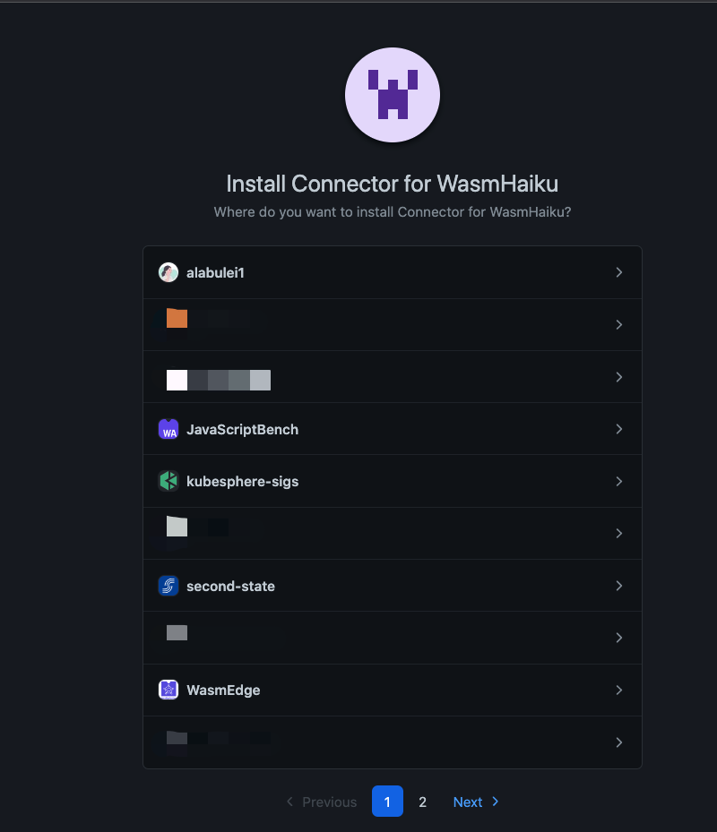
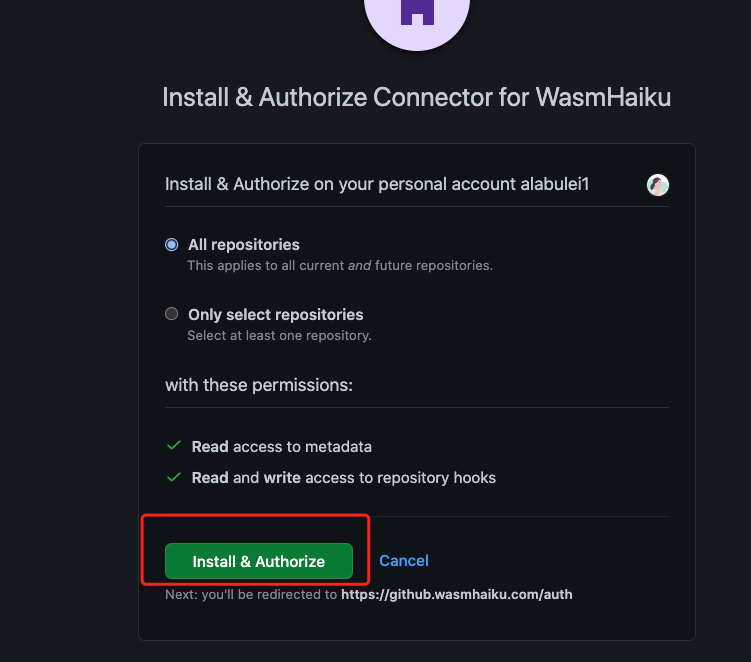
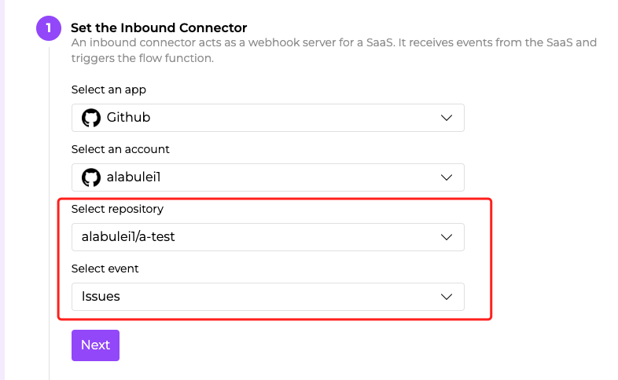
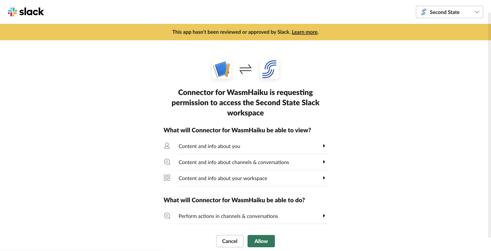
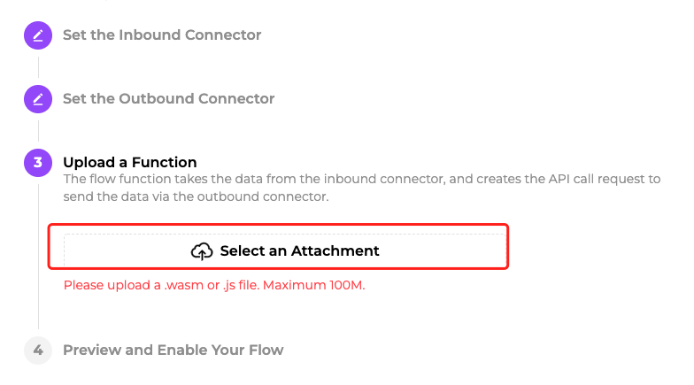
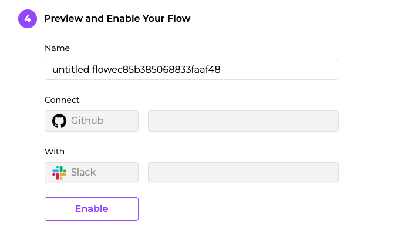

# Quick start in Rust

This article is a step-by-step guide to help users create their first flow on WasmHaiku. In this chapter, you will learn how to create a flow in 5 mins.

> To learn the basic concepts of WasmHaiku, please go to [What is a Flow chapter](what-is-a-flow.md).

## Before you start

First, make sure you have signed up for an account on [WasmHaiku](https://wasmhaiku.com/). It's free!

It's strongly recommended you already have answers to the following questions. 
1. Which SaaS is your inbound data from? (GitHub, GitLab, etc.)
2. Which kind of event want to monitor? (A new GitHub issue, a new merged PR, etc.)
3. Which SaaS you choose to send outbound messages? (Slack, Discord, etc)
4. which action do you want this flow to perform(Send a new channel message, a direct message, etc.)

With the goal of a flow in mind, it's easy to create your own flow. For example, let's say you want to get alerts on Slack whenever you have been assigned an issue on GitHub, since the original GitHub notifications by email are too many for you to identify which one is urgent.


Now, Click the **Create a Flow** button, and you will go to the create a flow page. 

## Select the inbound connector: GitHub

You need to configure an inbound connector as the data source in this section. 

First, click the **Scroll down** button under **Select an App**, and you will see the complete list of SaaS that WasmHaiku supports. Here we pick Github.



Next, click the **Continue** button to authenticate your GitHub account.

When you click the button **+ Authenticate Accoun**t, you will be directed to the third-party page provided by GitHub. This is to give WasmHaiku access to your data in the connected SaaS accounts. You can configure the GitHub org and repo for WasmHaiku to monitor on this page.



Click the **org name** to confirm WasmHaiku for GitHub.




Click the **Install & Authorize** button to finish the authentication. After that, confirm your passwords, and you will go back to the WasmHaiku platform automatically.

When you go back to the create a flow page, you will see your GitHub name. Click the **Continue** button to go to the next step.

Next, we need to choose the specific **Repo(s)** and then **GitHub event(s)** like the following image. Only the selected events from the inbound SaaS trigger actions (i.e., the flow function execution) in this flow. 



At this point, you have already set up the inbound connector. If a new issue is raised in GitHub repo alabulei/a-test, then what happens? Let's move to the outbound connector by clicking the **Next** button.


## Select the outbound connector: Slack

You need to configure an outbound connector as the target platform in this section. This process is very similar to the inbound connector. Here we choose Slack.

Next, click the **Continue** button to authenticate your Slack account. Same as the inbound connector, this is to let WasmHaiku make API calls on the outbound SaaS under your account.



You could configure the Slack workspace in the right-top scroll-down button. After that, click the **Allow** button to finish. And then, you will be redirected to the WasmHaiku page and will see your slack user name on this page. Let's continue by clicking the **Continue** button.

![]

Select the specific Slack channel and event to let WasmHaiku know where the message should be sent to.


At this point, you have already set up the outbound connector. If a new issue in GitHub repo alabulei/a-test, then send a message in Slack # everyone channel. The goal of this flow is clear now. Let's move to the Function part now by clicking the **Next** button.


## Compile and upload the flow function in Rust

What's unique about WasmHaiku is that it is programmable. You can write functions in Rust as you need. To simplify and for better understanding, we provided some code samples for users. You can find the sample [here](https://github.com/second-state/flow-functions).

Firstly, ensure you have installed [Rust](https://www.rust-lang.org/tools/install) and add the wasm32-wasi target.

```
rustup target add wasm32-wasi
```

Next, let's use the sample code provided by WasmHaiku and compile the Rust code to Wasm bytecode. 

```
Get the source code
$ git clone https://github.com/second-state/flow-functions.git
$ cd GitHub/slack/issue-notifier/
# compile the rust code to Wasm bytecode
$ cargo build  --target wasm32-wasi --release
```
After that, you will find the `.wasm` file in the release folder. Now it's time to upload the `issue_notifier.wasm` to the WasmHaiku platform.



Click the **Select an Attachmen**t to upload the wasm file. Now we have a flow function implementing our goal. It's time to enable this flow. After the wasm file is uploaded successfully, click the **Next** button to continue.

## Enable the flow
You can rename your flow and preview the inbound and outbound connectors in this section.




The most important thing here is to click the **Enable** button to make your flow work.

That's all! If new issues in GitHub, you will get an alert in Slack automatically.

Now, it's your turn to create your own flow.


