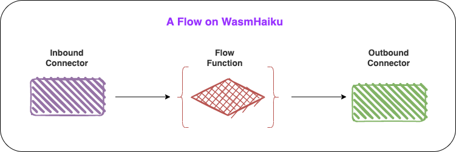

# What is a flow

Flow in WasmHaiku means a workflow that connects two SaaS APIs. First, a flow is triggered by an event from the inbound SaaS connector. Then the flow function processes the event. In the end, the flow then calls the outbound SaaS to connect to perform an action. 

A flow could describe as if something changes, then do it. For example, if this new GitHub issue is assigned to you, then add this GitHub issue to my notion to-do list.

WasmHaiku introduces three main concepts for automation work.

* ➡️ An **inbound connector** acts as a webhook server for a SaaS. It receives events from the SaaS and triggers the flow function.
* ➡️  An **outbound connector** takes the output from the flow function and invokes an API call on the outbound SaaS.
* ↔️ The **flow function** takes the data from the inbound connector and creates the API call request to be sent to the outbound connector. 

The following image shows a complete flow.

Now you have understand how WasmHaiku works. Let's move to the next section: create a flow in 5 mins.

