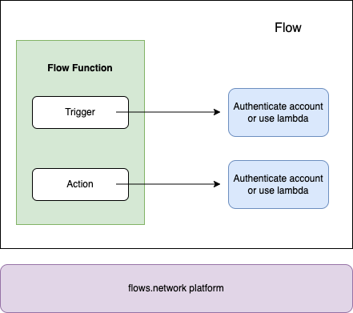

# Overview

The highlight use case of flows.network is to automate your workflows across multiple SaaS in a serverless way. 

Before we start, let's go through the process of automating your workflows.

* Trigger: when something happened that meets the requirements, this flow will be performed. It is usually a SaaS event like a new GitHub issue, a new GitHub PR, and a new tweet. 
* Action: What will happen if the trigger is triggered. It's usually another SaaS event like send a new message to Slack/Discord/Telegram, create a new issue or save to notion/a database.
* Flow: A flow connects two SaaS APIs. It is triggered by a trigger SaaS event. The flow function processes the event and the flow then calls another SaaS event to perform an action.

In this chapter, we will learn how to automate the SaaS workflow.

* [Slack Calculator bot](slack.md)
* [Save Slack messages to Notion](slack-notion.md)
* [Send GitHub issues to Slack](github.md)
* [Send a scheduled email](sendgrid.md)
* [Save GitHub fork status to Airtable](airtable.md)

