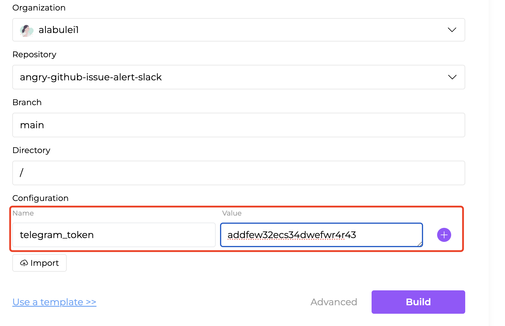

# Troubleshooting

## Creating a flow from a Flow Template

## Creating a flow from importing source code

### How to save some private parameters when importing my source code 

You don't need to write these parameters in your code, which is dangerous. Flows.network platform provides a feature to pass your data via environment variables. You can click the Advanced link to see more settings including branch and folder of your GitHub repo and some configs. The config here can help you save your private parameters like API Key/token.

### I have problems authenticating the SaaS integrations, can you guide me?

For connecting the SaaS integrations, please refer to [the series of integration guide](https://flows.network/blog/tags/integration-guide) article.

## After creating a flow

### I've pushed commits to my GitHub repo, but why isn't flows.network building my code automatically?

Please check the following items: 
- Have you disconnected the GitHub repo for your flow? If so, flows.network won't be able to listen to your GitHub repo anymore. 
- Have you changed the name of your GitHub repo? If you have, the listener for your repo won't work properly.

### I used `flowsnet-platform-sdk` and added the log info in my code, Why I can't see any logs in the Running Log tab

Please check out if you have added `RUST_LOG` in the Configuration section.

| Name     | Value |
|----------|-------|
| RUST_LOG | debug (You can type any name here) |

