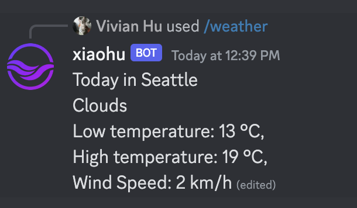

# Integrate Webhook with Discord

In this article, I will show you how to use **slash commands** to interact with your Discord bot based on an external web service. Specifically, this flow function is a weather inquiry bot. When you type /weather + the city name, the bot will respond to you with the weather information of this city.



## Prerequisites
1. A GitHub account to log into the [flows.network](https://flows.network/) platform. It's free.
2. A Discord server that you have permission to add a bot.

## Prepare the source code

For this tutorial, we already created [a repo named `discord-api-demo`](https://github.com/flows-network/discord-api-demo) for you to fork.

## Import and build

[Click here](https://flows.network/flow/new) to import your forked source code repo for the flow function into flows.network.

For this flow function, we need to add a Discord token and the channel id in settings so that it can listen for messages on a designated channel from a specific Discord bot.
Please refer to [How to create a Discord chat bot](https://flows.network/blog/discord-chat-bot-guide) on how to get your Discord token and refer to [How to get Discord channel id](https://flows.network/blog/#how-to-get-the-discord-channel-id) for the channel id.
Click on the **Advanced** link to configure the settings.

| Name             | Value                                                                                       |
| ---------------- | ------------------------------------------------------------------------------------------- |
| discord_token    | Copied from Discord Developer Portal                                                        |
| discord_channel_id | Copied from Discord channel link  |

Click on the **Build** button to create the flow function.

In the next screen, you will be asked to connect to Discord. Since we are providing a Discord API token to access the bot here, you can simply click on **Deploy**.

## Deploy

Finally, you will be redirected to the flow details page, where you can check for service status and logs. Discord and OpenAI should appear as connected external services on this page.

When the status of the flow is ready and running, you can invite the Discord bot to your server.

> Refer to this guide to [invite the bot to your server](https://flows.network/blog/discord-chat-bot-guide).

After the bot joins your server, you can find the bot on the right online contact list. Then you can go to the specific channel and type /weather + name to give it a try.

## Code walkthrough

The source code for the flow function is written in the Rust programming language. 
The `on_deploy()` function is called by the flows.network platform when the flow is deployed. We start a listener for
the designated bot in `on_deploy()`. 

```
pub async fn on_deploy() {
    logger::init();
    let discord_token = env::var("discord_token").unwrap();
    let bot = ProvidedBot::new(&discord_token);

    register_commands().await;

    bot.listen_to_messages().await;

    let channel_id = env::var("discord_channel_id").unwrap_or("channel_id not found".to_string());
    let channel_id = channel_id.parse::<u64>().unwrap();
    bot.listen_to_application_commands_from_channel(channel_id)
        .await;
}
```
The `handle()` function is annotated with `#[message_handler]`. It is called when the bot receives a message. It calls `send_message()` on the client to send a message `msg.content` back to the same channel.

```
#[message_handler]
async fn handle(msg: Message) {
    logger::init();
    let discord_token = std::env::var("discord_token").unwrap();
    let bot = ProvidedBot::new(&discord_token);

    if msg.author.bot {
        return;
    }
    let client = bot.get_client();
    _ = client
        .send_message(
            msg.channel_id.into(),
            &serde_json::json!({
                "content": msg.content,
            }),
        )
        .await;
}
```

Next, the `handler` function is annotated with `#[application_command_handler]`. If the input matches a `/weather` command, it will extract the `city` option from the command arguments and then call the `get_weather()` function to look up weather data for the given city. Finally, it will send the content to the channel. 

```
#[application_command_handler]
async fn handler(ac: ApplicationCommandInteraction) {
    logger::init();
    let discord_token = env::var("discord_token").unwrap();
    let bot = ProvidedBot::new(discord_token);
    let client = bot.get_client();

    client.set_application_id(ac.application_id.into());

    _ = client
        .create_interaction_response(
            ac.id.into(),
            &ac.token,
            &serde_json::json!({
                "type": InteractionResponseType::DeferredChannelMessageWithSource as u8,
            }),
        )
        .await;
    let options = &ac.data.options;
// Listen to the slash command
    match ac.data.name.as_str() {
        "weather" => {
            let city = match options
                .get(0)
                .expect("Expected city option")
                .resolved
                .as_ref()
                .expect("Expected city object")
            {
                CommandDataOptionValue::String(s) => s,
                _ => panic!("Expected string for city"),
            };
// Send the result to the channel
            let resp_inner = match get_weather(&city) {
                Some(w) => format!(
                    r#"Today: {},
                Low temperature: {} °C,
                High temperature: {} °C,
                Wind Speed: {} km/h"#,
                    w.weather
                        .first()
                        .unwrap_or(&Weather {
                            main: "Unknown".to_string()
                        })
                        .main,
                    w.main.temp_min as i32,
                    w.main.temp_max as i32,
                    w.wind.speed as i32
                ),
                None => String::from("No city or incorrect spelling"),
            };
            let resp = serde_json::json!({ "content": resp_inner });
            _ = client
                .edit_original_interaction_response(&ac.token, &resp)
                .await;
        }
        _ => {}
    }
}
```
 
Now Let's walk through the `get_weather` function. This is the core function of this weather inquiry bot. It makes OpenWeatherMap's API call to retrieve weather data for a given city and return the result. It will deserialize the response vector into an `ApiResult` struct using `serde_json`.

```
// inquiry the weather in `{city}`
fn get_weather(city: &str) -> Option<ApiResult> {
    let mut writer = Vec::new();
    let api_key = env::var("API_KEY").unwrap_or("fake_api_key".to_string());
    let query_str = format!(
        "https://api.openweathermap.org/data/2.5/weather?q={city}&units=metric&appid={api_key}"
    );

    let uri = Uri::try_from(query_str.as_str()).unwrap();
    match Request::new(&uri).method(Method::GET).send(&mut writer) {
        Err(_e) => log::error!("Error getting response from weather api: {:?}", _e),

        Ok(res) => {
            if !res.status_code().is_success() {
                log::error!("weather api http error: {:?}", res.status_code());
                return None;
            }
            match serde_json::from_slice::<ApiResult>(&writer) {
                Err(_e) => log::error!("Error deserializing weather api response: {:?}", _e),
                Ok(w) => {
                    log::info!("Weather: {:?}", w);
                    return Some(w);
                }
            }
        }
    };
    None
}
```

Finally, let's dive into how to register a slash command for a bot. The following code registers a slash command `weather` for a Discord bot with the `discord_token` using Discord's HTTP API.

```
async fn register_commands() {
    let command = serde_json::json!({
        "name": "weather",
        "description": "Get the weather for a city",
        "options": [
            {
                "name": "city",
                "description": "The city to lookup",
                "type": 3,
                "required": true
            }
        ]
    });

    let discord_token = env::var("discord_token").unwrap();
    let http_client = HttpBuilder::new(discord_token).build();

    match http_client
        .create_global_application_command(&command)
        .await
    {
        Ok(_) => log::info!("Successfully registered command"),
        Err(err) => log::error!("Error registering command: {}", err),
    }
}
```
You also need to structure the output data format, refer to this [snippet](https://github.com/flows-network/discord-webhook-demo/blob/main/src/lib.rs#L119-L140) for more information.
