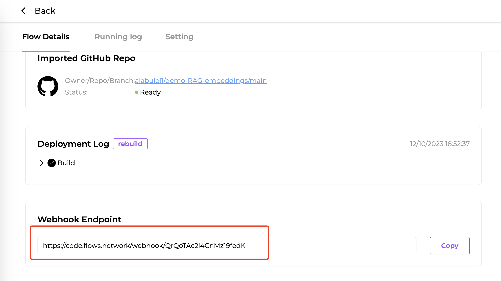

# Create embedding for your data via the vector DB

There are two ways to deal with the hallucination from LLM's answer. One is to fine-tune a new model with your domain knowledge. The other one is to build a RAG-based (Retrieval-Augmented Generation) LLM agent via a vector DB. Both solutions can solve the challenge. However, fine-tuning a model requires GPU, which is more expensive. In this series of tutorials, I will walk you through how to build a RAG-based LLM agent.

This article is the first part: create embeddings for your data via the vector DB.  This is essential for the chatbot's ability to retrieve relevant information.

## Prerequisites

1. A GitHub account to log into the [flows.network](https://flows.network/) platform. It's free.
2. An Open API key to convert text to embeddings

## Prepare Embeddings for Your Knowledge Base

There are various methods to split your knowledge base into several chunks. You can choose one to implement. The desired output for this step is a `.txt` file.

## Prepare the source code

For this part, we already created a repo named [demo-RAG-embeddings](https://github.com/flows-network/demo-RAG-embeddings) for you to fork.

## Creating the Webhook for Connecting the Vector DB

Import the forked repository to [flows.network](https://flows.network), and then the platform will build and deploy the source code. During this process, you will need to **add your OpenAI key**. 

> For a detailed guide, you can refer to [this video](https://youtu.be/5h24a2S3G8k) or the [Get Started](https://docs.flows.network/docs/getting-started-developer/hello-world#import-build-and-deploy) guide.

Upon successful completion of the function build, you will receive a URL at the "Webhook Endpoint" section on the flow details page. This URL will be used to upload the text chunks.



## Upload your prepared text chunks to the vector DB

To add your content to the vector DB, follow these steps:

- Upload your `.txt` file to the demo repository you forked earlier. You can save it locally.

- Open your terminal and execute the following commands:

```bash
  # Clone the source code
  git clone https://github.com/your_github_id/demo-RAG-embeddings.git
  cd demo-RAG-embeddings

  # Upload the content
  # Replace the Webhook URL with the one obtained in the previous step
  # The collection_name is up to you, but remember the name for later use
  # "@your_file.txt" should be changed to your file name
  curl "https://code.flows.network/webhook/I9GNgD5hyhFLY25DsOUI?collection_name=your_collection_name&vector_size=1536&reset=1" -X POST --data-binary "@your_file.txt"
```

After successful addition, the terminal will prompt how many embeddings have been created in total.

```bash
Successfully inserted 7 records. The collection now has 7 records in total
```

Now we have created the embeddings. Next, let's build an LLM agent for your knowledge base.

* [Build a web chatbot with the embeddings](/docs/tutorials/rag-based-llm-agent/embedding-web-chatbot.md)
* [Build a Discord bot with the embeddings](/docs/tutorials/rag-based-llm-agent/embedding-discord-bot.md)